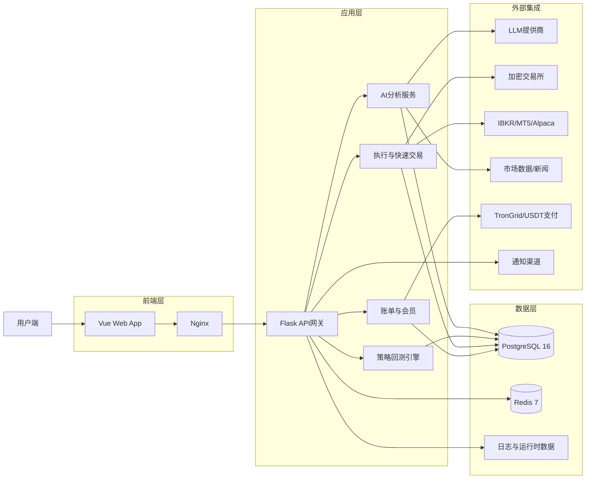

# QuantDinger 项目全面研究报告

## 1. 项目概述

### 1.1 项目简介

**QuantDinger** 是一个自托管的量化交易操作系统，提供从AI辅助研究到实盘交易的全流程解决方案。该项目采用现代技术栈构建，集成了多市场数据获取、策略回测、AI分析和实盘执行等完整功能。

- **版本**: 3.0.10
- **许可证**: Apache 2.0
- **开发语言**: Python (后端) + Vue (前端)
- **部署方式**: Docker Compose
- **前端仓库**: [QuantDinger-Vue](https://github.com/brokermr810/QuantDinger-Vue) (独立发布的Vue前端代码库，发布至ghcr.io/brokermr810/quantdinger-frontend镜像

### 1.2 核心特性

1. **多市场支持**:
   - 加密货币 (Binance等)
   - 美股 (Alpaca)
   - 港股/A股 (多数据源)
   - 外汇 (MT5)
   - 股票 (IBKR)

2. **AI集成**:
   - 多LLM提供商支持 (OpenRouter, OpenAI, Google, DeepSeek等)
   - AI辅助策略生成和分析
   - AI代码生成 (Code Gen)

3. **策略与回测:
   - Python原生策略
   - 服务器端回测引擎
   - 策略可视化
   - 实验管道

4. **实盘执行:
   - 快速交易
   - 模拟交易
   - 实时监控
   - 通知系统 (Telegram, Email, SMS, Discord, Webhook)

5. **Agent网关与MCP:
   - 支持Cursor/Claude Code/Codex外部AI代理集成
   - MCP (Model Context Protocol)服务器
   - 细粒度权限控制

## 2. 系统架构

### 2.1 整体架构



### 2.2 部署架构 (Docker Compose)

QuantDinger使用四个核心服务组成，通过Docker Compose部署：

1. **PostgreSQL 16**: 主数据库，存储所有业务数据
2. **Redis 7**: 缓存层和工作队列
3. **Flask后端 API**: 业务逻辑服务
4. **Nginx前端**: 提供Vue SPA代理和静态文件服务

**Docker Compose配置亮点：
- 前端直接拉取预构建的Vue镜像，无需Node.js
- 后端从源代码构建
- 完整的健康检查机制
- 网络隔离配置
- 数据持久化卷管理

## 3. 前端界面设计与功能模块

### 3.1 前端技术栈

- **框架**: Vue.js
- **构建**: 预编译GHCR镜像
- **代理**: Nginx
- **通信**: REST API与后端通信

### 3.2 核心功能模块

1. **仪表盘 (Dashboard)
   - 资产概览
   - 市场雷达图
   - 快速访问入口

2. **指标IDE** ([Indicator IDE)
   - 图表与K线图
   - 技术指标叠加
   - 策略信号回测

3. **AI资产分析**
   - 市场分析
   - 机会雷达
   - 多时间周期分析
   - 多模型集成/校准

4. **策略管理
   - 策略编辑器
   - 参数优化
   - 回测结果展示
   - 实盘运行监控

5. **交易机器人**
   - 自动化模板
   - 交易配置

6. **统一券商账户管理
   - 多券商统一接入
   - 账户KPI
   - 持仓管理
   - 订单管理

7. **Agent令牌管理
   - 权限控制
   - 审计日志
   - 令牌发布与撤销

8. **设置与管理**
   - 品牌定制
   - 用户管理
   - 计费配置
   - 安全设置

### 3.3 前端关键设计点

1. **可定制品牌 (Whitelabel)
   - 品牌Logo,版本标签页脚等可通过环境变量和API配置
   - 无需重新编译前端即可更换主题和品牌

2. **无需本地构建前端
   - 直接拉取预构建的Docker镜像
   - 支持快速部署

3. **Nginx配置代理
   - 前端通过代理访问后端API
   - 支持HTTPS
   - CORS配置

## 4. 后端系统架构与API设计

### 4.1 后端项目结构

```
backend_api_python/
├── app/
│   ├── __init__.py              # Flask应用入口
│   ├── config/                  # 配置模块
│   ├── data/                    # 数据处理
│   ├── data_providers/          # 数据提供器
│   ├── data_sources/           # 数据源
│   ├── routes/                # API路由
│   │   ├── agent_v1/          # Agent网关v1
│   │   ├── ai_chat.py
│   │   ├── alpaca.py
│   │   ├── auth.py
│   │   ├── backtest.py
│   │   ├── billing.py
│   │   ├── community.py
│   │   ├── credentials.py
│   │   ├── dashboard.py
│   │   ├── experiment.py
│   │   ├── fast_analysis.py
│   │   ├── global_market.py
│   │   ├── health.py
│   │   ├── ibkr.py
│   │   ├── indicator.py
│   │   ├── kline.py
│   │   ├── market.py
│   │   ├── mt5.py
│   │   ├── portfolio.py
│   │   ├── quick_trade.py
│   │   ├── settings.py
│   │   ├── strategy.py
│   │   └── user.py
│   ├── services/              # 业务逻辑服务
│   └── utils/                 # 工具函数
├── migrations/               # 数据库初始化SQL
├── tests/                  # 测试
├── run.py                # 本地运行入口
├── Dockerfile
├── env.example          # 环境变量示例
├── requirements.txt
└── gunicorn_config.py   # Gunicorn配置
```

### 4.2 API路由模块分析

| 模块名称 | 功能说明 | 文件大小 |
|---------|--------|---------|
| **auth.py** | 用户认证与授权 | 47,983 |
| **strategy.py** | 策略管理 | 92,056 |
| **quick_trade.py** | 快速交易 | 77,157 |
| **settings.py** | 系统设置 | 72,404 |
| **user.py** | 用户管理 | 83,058 |
| **indicator.py** | 指标计算 | 67,001 |
| **backtest.py** | 回测引擎 | 40,167 |
| **portfolio.py** | 投资组合管理 | 43,532 |
| **market.py** | 市场数据 | 35,126 |
| **dashboard.py** | 仪表盘数据 | 32,155 |
| **credentials.py** | 凭证管理 | 12,422 |
| **fast_analysis.py** | 快速分析 | 24,726 |
| **ibkr.py** | IBKR接口 | 10,207 |
| **mt5.py** | MT5接口 | 14,156 |
| **alpaca.py** | Alpaca接口 | 9,417 |
| **agent_v1/** | Agent网关 | 目录 |

### 4.3 关键设计特点

1. **模块化架构**
   - 每个功能独立模块负责独立路由
   - 服务层与路由层分离

2. **Gunicorn并发配置**
   - 单进程多线程模式
   - 默认配置：1 worker, 8 threads

3. **数据库连接池**
   - psycopg2 ThreadedConnectionPool
   - 最小连接5，最大连接50
   - 健康检查机制

4. **异步执行器
   - 市场数据执行器：6线程
   - 组合管理执行器：3线程

## 5. 数据存储与缓存机制

### 5.1 PostgreSQL 16数据库

**核心设计要点**

1. **连接池调优
   ```python
   DB_POOL_MIN=5
   DB_POOL_MAX=50
   DB_POOL_ACQUIRE_TIMEOUT=10
   DB_POOL_HEALTH_CHECK=true
   ```

2. **数据库参数调优
   ```yaml
   PG_MAX_CONNECTIONS=150
   PG_SHARED_BUFFERS=256MB
   ```

3. **自动迁移**
   - 启动时自动应用`migrations/init.sql`
   - 使用`CREATE TABLE IF NOT EXISTS`保证幂等性

### 5.2 Redis 7缓存

1. **配置
   - 内存上限：128MB
   - 淘汰策略：allkeys-lru
   - 启用条件：CACHE_ENABLED=true

2. **价格缓存TTL
   - 10秒

### 5.3 数据来源系统

1. **多数据源支持
   - CCXT (加密货币)
   - AKShare (A股/港股)
   - YFinance
   - Finnhub
   - TwelveData
   - 等

2. **数据源配置
   ```python
   DATA_SOURCE_TIMEOUT=30
   DATA_SOURCE_RETRY=3
   DATA_SOURCE_RETRY_BACKOFF=0.5
   ```

3. **代理支持
   - 专为中国网络设计的代理配置
   - 支持HTTP和SOCKS5代理

## 6. AI Agent集成与MCP协议

### 6.1 Agent网关架构

**设计文档位于`docs/agent/AI_INTEGRATION_DESIGN.md`

### 6.2 核心设计理念

1. **能力分类（风险分级
   - R (Read): 只读市场数据、K线、指标、策略列表、回测结果
   - W (Workspace Write): 策略代码创建更新、指标代码保存、实验配置
   - B (Backtest): 回测执行、实验管道运行
   - N (Notifications): 通知发送、用户偏好设置
   - C (Credentials): 凭证管理（默认禁用，管理员专属
   - T (Trading): 交易执行（默认禁用，实盘需显式启用）

2. **安全机制
   - Agent令牌独立于用户JWT
   - 审计日志记录所有操作
   - 幂等性支持
   - 实盘交易双重保护

### 6.3 Agent网关API

**命名空间**：`/api/agent/v1/`

**端点示例**：
- `/health` - 健康检查
- `/markets` - 市场列表
- `/markets/{market}/symbols` - 交易对列表
- `/klines` - K线数据
- `/indicators/run` - 指标计算
- `/strategies` - 策略CRUD
- `/backtests` - 异步回测任务
- `/experiments/regime/detect` - 市场状态检测
- `/portfolio` - 投资组合
- `/quick-trade/orders` - 快速交易

### 6.4 MCP服务器

**项目内置了MCP服务器，位于`mcp_server/`目录：
- 封装Agent API为MCP工具
- 支持Cursor/Claude Code/Codex等IDE工具

**配置**：
```json
{
  "mcpServers": {
    "quantdinger": {
      "command": "uvx",
      "args": ["quantdinger-mcp"],
      "env": {
        "QUANTDINGER_BASE_URL": "http://localhost:8888",
        "QUANTDINGER_AGENT_TOKEN": "qd_agent_..."
      }
    }
  }
}
```

### 6.5 部署模式控制

通过`QUANTDINGER_DEPLOYMENT_MODE`：
- 未设置/self：自托管，管理员完全控制T类权限
- saas/hosted：托管模式，强制paper_only=true，T类权限403拒绝

## 7. 策略与回测系统

### 7.1 策略类型

1. **IndicatorStrategy**
   - DataFrame信号策略
   - 图表叠加
   - 可视化友好

2. **ScriptStrategy**
   - `on_bar`显式订单
   - 更灵活的控制

### 7.2 回测系统

- 服务器端回测
- 异步任务队列
- 指标计算
- 权益曲线
- 策略快照保存

### 7.3 实验管道

-  regimes检测
- 参数优化
- 批量回测
- 结构化结果

## 8. 计费与会员系统

### 8.1 积分系统

**积分消耗**：
- AI分析：10积分/次
- AI代码生成：30积分/次

**会员计划**：
- 月度会员：$19.9/月，500积分/月
- 年度会员：$199/年，8000积分/年
- 终身会员：$499，800积分/月

### 8.2 USDT支付

- TRC20/BEP20/ERC20/SOL
- 金额后缀唯一标识
- 固定接收地址

## 9. 环境配置详解

### 9.1 核心配置

```
# 认证
SECRET_KEY=...
ADMIN_USER=quantdinger
ADMIN_PASSWORD=123456

# 数据库
DATABASE_URL=postgresql://...

# LLM配置
LLM_PROVIDER=openrouter
OPENROUTER_API_KEY=...
OPENROUTER_MODEL=openai/gpt-4o

# 数据库连接池
DB_POOL_MIN=5
DB_POOL_MAX=50

# Gunicorn
GUNICORN_WORKERS=1
GUNICORN_THREADS=8
```

### 9.2 高级配置

- AI集成
- 通知配置
- 支付配置
- 代理配置
- 市场可见性配置

## 10. 可借鉴要点总结

### 10.1 架构设计借鉴

1. **Docker Compose一键部署
   - 前后端分离，前端预构建
   - 数据库和缓存服务编排
   - 网络隔离

2. **模块化Flask架构
   - 路由层与服务层分离
   - 按功能模块组织路由
   - 统一的认证和配置管理

3. **多市场多数据源抽象
   - 统一数据提供器接口
   - 故障转移机制
   - 代理支持

### 10.2 功能设计借鉴

1. **AI Agent网关
   - 外部AI代理集成
   - 细粒度权限控制
   - 审计日志
   - MCP协议支持

2. **可定制品牌
   - 无需重新编译
   - 环境变量配置
   - 后端API提供品牌配置

3. **统一券商账户管理
   - 多券商统一接入和管理
   - 统一的订单和持仓管理

4. **策略与回测
   - 服务器端回测
   - 异步任务队列
   - 实验管道

### 10.3 安全设计借鉴

1. **风险分级能力
   - R/W/B/N/C/T分类
   - 默认禁用高风险

2. **令牌与JWT分离
   - Agent令牌独立
   - 前缀标识
   - 审计日志

3. **托管模式保护
   - 强制paper_only=true
   - 显式拒绝T类

### 10.4 部署与运维

1. **预构建前端
   - GHCR镜像
   - 无需Node.js
   - 快速部署

2. **自动迁移
   - 幂等SQL
   - CREATE TABLE IF NOT EXISTS

3. **连接池调优
   - psycopg2 ThreadedConnectionPool
   - 健康检查

4. **健康检查
   - 容器级健康检查
   - 服务级健康检查

## 11. 与现有系统融合建议

### 11.1 对当前项目的借鉴价值

1. **数据获取与存储系统：
   - 当前已有完整的A股数据获取系统
   - 可借鉴多数据源抽象和故障转移机制

2. **策略回测：
   - 当前已有基础回测系统
   - 可借鉴QuantDinger的异步任务队列和实验管道

3. **前端界面：
   - 当前已有Web界面需求
   - 可借鉴QuantDinger的设计理念和模块划分

4. **AI集成：
   - 当前已有本地LLM集成
   - 可借鉴Agent网关和MCP协议

### 11.2 具体建议

1. **短期（1-2周）：
   - 研究Docker Compose部署方案
   - 设计模块化后端架构
   - 统一数据来源抽象

2. **中期（1-2月）：
   - 引入异步任务队列
   - 实验管道
   - API设计

3. **长期（3-6月）：
   - Agent网关
   - MCP协议
   - 多市场扩展

## 12. 总结

QuantDinger项目是一个设计精良的量化交易系统，具有完整的从研究到实盘的全流程解决方案。其架构设计、功能模块化、安全机制和部署方式都有很高的借鉴价值，特别是：

- Docker Compose一键部署
- 前后端分离预构建前端
- Agent网关与MCP协议
- 风险分级能力控制
- 多市场多数据源
- 完整策略与回测

对于当前项目的发展具有重要的参考意义。

---

**报告生成时间**：2026-06-03
**研究人员**：AI研究助手
**项目链接**：https://github.com/brokermr810/QuantDinger
