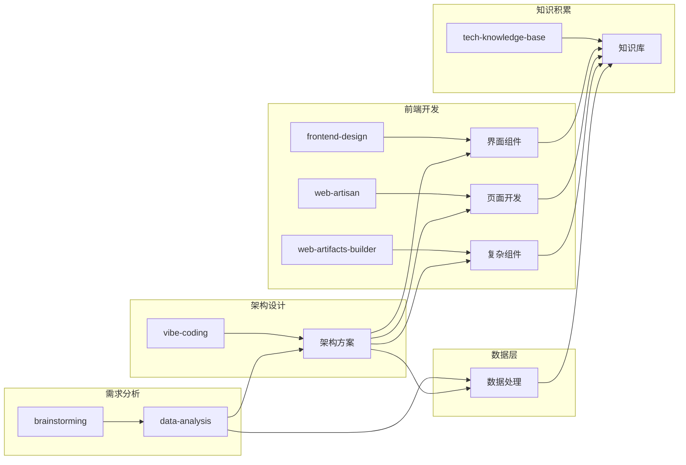
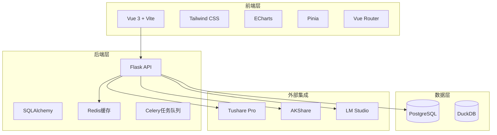
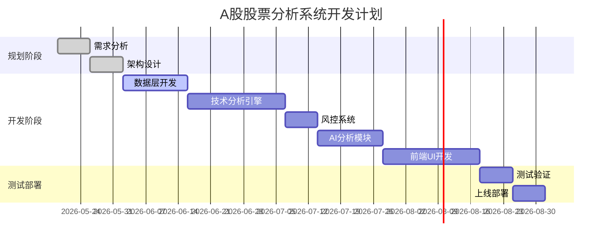

# A股股票分析决策支持系统 - 方案B定制化开发规划

> **基于QuantDinger架构借鉴 + A股市场定制**
>
> **方案编号**：055
> **制定日期**：2026-05-19
> **存档位置**：`/Users/kalence/Desktop/测试/002-方案存档/055-A股股票分析系统-方案B定制化开发规划.md`

---

## 目录

1. [技能资源盘点](#1-技能资源盘点)
2. [项目架构设计](#2-项目架构设计)
3. [分阶段开发计划](#3-分阶段开发计划)
4. [技能调用规划](#4-技能调用规划)
5. [执行时间表](#5-执行时间表)
6. [资源需求评估](#6-资源需求评估)
7. [风险评估与应对](#7-风险评估与应对)

---

## 1. 技能资源盘点

### 1.1 系统可用技能

| 技能名称 | 功能描述 | 适用阶段 |
|---------|---------|---------|
| **vibe-coding** | AI结对编程工作流程，α/Ω提示词生成 | 全流程 |
| **frontend-design** | 前端界面设计，组件开发 | 前端开发阶段 |
| **data-analysis** | Excel/CSV数据处理分析 | 数据层开发 |
| **web-artisan** | Web应用开发，React/Vue组件 | 前端开发阶段 |
| **web-artifacts-builder** | 复杂HTML组件构建 | 前端组件开发 |
| **tech-knowledge-base** | 技术知识库管理 | 全流程知识积累 |
| **brainstorming** | 创意设计头脑风暴 | 需求分析阶段 |

### 1.2 技能调用策略



---

## 2. 项目架构设计

### 2.1 整体架构



### 2.2 核心模块设计

| 模块 | 功能说明 | 技术实现 |
|------|---------|---------|
| **数据获取模块** | Tushare/AKShare数据抓取 | Python + requests |
| **技术分析模块** | 插件化指标计算引擎 | 自定义基类 + TA-Lib |
| **信号生成模块** | 多指标综合评分系统 | Python + 自定义算法 |
| **风控模块** | 仓位计算、止损止盈 | Python + 自定义算法 |
| **AI分析模块** | 本地大模型集成 | LM Studio API |
| **前端展示模块** | K线图、信号监控、报告 | Vue 3 + ECharts |

### 2.3 目录结构

```
stock_analysis_system/
├── docker-compose.yml
├── .env.example
├── requirements.txt
├── backend/
│   ├── app/
│   │   ├── routes/          # API路由
│   │   ├── services/        # 业务逻辑
│   │   ├── analysis/        # 技术分析引擎
│   │   ├── data/            # 数据获取
│   │   ├── signals/         # 信号生成
│   │   ├── risk/            # 风控模块
│   │   └── utils/           # 工具函数
│   └── migrations/          # 数据库迁移
├── frontend/
│   ├── src/
│   │   ├── components/      # 组件库
│   │   ├── views/           # 页面视图
│   │   ├── stores/          # 状态管理
│   │   └── utils/           # 工具函数
│   └── public/
└── data/
    ├── duckdb/
    └── reports/
```

---

## 3. 分阶段开发计划

### 阶段一：需求分析与架构设计（1周）

#### 任务清单
- [ ] 需求调研和分析（brainstorming技能）
- [ ] 架构设计（vibe-coding技能）
- [ ] 技术选型确认
- [ ] 项目初始化

#### 技能调用
```
vibe-coding alpha: 请为A股股票分析决策支持系统设计完整的后端架构...
brainstorming: 分析A股用户的核心需求和使用场景...
```

#### 输出成果
- 需求分析文档
- 系统架构设计文档
- 技术选型报告
- 项目初始化代码

---

### 阶段二：数据层开发（2周）

#### 任务清单
- [ ] Tushare数据接口封装
- [ ] DuckDB缓存机制实现
- [ ] PostgreSQL数据表设计
- [ ] 数据定时更新任务

#### 技能调用
```
vibe-coding alpha: 请实现一个Tushare数据获取服务，支持股票列表、日线数据、财务数据...
data-analysis: 分析A股数据结构和字段定义...
```

#### 输出成果
- 数据获取服务
- 数据库表结构
- 缓存机制
- 定时任务配置

---

### 阶段三：技术分析引擎开发（3周）

#### 任务清单
- [ ] 指标基类设计
- [ ] 核心指标实现（MACD、RSI、KDJ、布林带等）
- [ ] 指标管理器实现
- [ ] 信号生成系统

#### 技能调用
```
vibe-coding alpha: 请设计一个插件化技术指标系统，包含基类、管理器和多种指标实现...
vibe-coding omega: 优化指标计算性能和信号生成算法...
```

#### 输出成果
- 指标基类
- 核心指标插件（MACD、RSI、KDJ、布林带等）
- 指标管理器
- 信号生成系统

---

### 阶段四：风控系统开发（1周）

#### 任务清单
- [ ] 仓位计算器
- [ ] 止损止盈计算器
- [ ] A股规则适配（T+1、涨跌停等）
- [ ] 风险评估系统

#### 技能调用
```
vibe-coding alpha: 请实现一个A股专用的风控管理系统，支持仓位计算和止损止盈...
```

#### 输出成果
- 仓位计算服务
- 止损止盈计算器
- A股规则提示组件
- 风险评估系统

---

### 阶段五：AI分析模块开发（2周）

#### 任务清单
- [ ] LM Studio API集成
- [ ] AI分析服务构建
- [ ] 报告生成器
- [ ] 信号解释功能

#### 技能调用
```
vibe-coding alpha: 请实现一个AI分析服务，集成LM Studio本地大模型...
```

#### 输出成果
- LM Studio集成服务
- AI分析API
- 报告生成器
- 信号解释功能

---

### 阶段六：前端UI开发（3周）

#### 任务清单
- [ ] 仪表盘页面（frontend-design）
- [ ] 指标分析IDE（web-artisan）
- [ ] AI分析助手页面（web-artifacts-builder）
- [ ] 信号监控页面
- [ ] 风控中心页面

#### 技能调用
```
frontend-design: 设计一个专业的股票分析仪表盘页面，深蓝色主题...
web-artisan: 创建一个功能完善的K线图分析页面...
web-artifacts-builder: 构建一个AI聊天界面组件...
```

#### 输出成果
- 仪表盘页面
- 指标分析IDE
- AI分析助手
- 信号监控页面
- 风控中心页面

---

### 阶段七：测试与部署（1周）

#### 任务清单
- [ ] 单元测试
- [ ] 集成测试
- [ ] Docker部署配置
- [ ] 系统上线

#### 输出成果
- 测试用例
- Docker配置
- 部署文档

---

## 4. 技能调用规划

### 4.1 技能调用矩阵

| 阶段 | 技能 | 调用内容 | 输出成果 |
|------|------|---------|---------|
| 需求分析 | brainstorming | A股用户需求分析 | 需求文档 |
| 架构设计 | vibe-coding | 系统架构设计 | 架构方案 |
| 数据层 | vibe-coding + data-analysis | 数据服务开发 | 数据API |
| 分析引擎 | vibe-coding | 指标系统开发 | 技术分析模块 |
| 风控系统 | vibe-coding | 风控模块开发 | 风控API |
| AI模块 | vibe-coding | AI服务开发 | AI分析模块 |
| 前端页面 | frontend-design | 页面设计 | UI组件 |
| 复杂组件 | web-artisan + web-artifacts-builder | 组件开发 | 页面组件 |
| 知识积累 | tech-knowledge-base | 方案存档 | 知识库 |

### 4.2 核心提示词模板

```
# Alpha提示词模板 - 后端开发
请为A股股票分析决策支持系统实现一个{模块名称}，要求：
1. 参考QuantDinger的模块化架构
2. 适配A股市场特点（T+1、涨跌停限制等）
3. 使用Python + Flask技术栈
4. 提供RESTful API接口
5. 支持PostgreSQL和Redis

# Alpha提示词模板 - 前端开发
请设计一个{页面名称}，要求：
1. 专业金融风格，深蓝色主题
2. 响应式设计，支持移动端
3. 包含{核心功能}
4. Vue 3 + Tailwind CSS + ECharts技术栈
5. 符合A股用户使用习惯
```

---

## 5. 执行时间表

### 甘特图



### 里程碑计划

| 阶段 | 时间 | 里程碑 | 交付物 |
|------|------|--------|-------|
| **阶段1** | 第1-2周 | 规划完成 | 需求文档、架构设计 |
| **阶段2** | 第3-4周 | 数据层完成 | 数据API、数据库设计 |
| **阶段3** | 第5-7周 | 分析引擎完成 | 技术指标系统、信号生成 |
| **阶段4** | 第8周 | 风控系统完成 | 仓位计算、止损止盈 |
| **阶段5** | 第9-10周 | AI模块完成 | AI分析服务、报告生成 |
| **阶段6** | 第11-13周 | 前端完成 | 完整UI界面 |
| **阶段7** | 第14周 | 测试部署 | 系统上线 |

---

## 6. 资源需求评估

### 6.1 人力需求

| 角色 | 人数 | 职责 |
|------|------|------|
| 后端开发 | 1-2人 | Flask API、数据处理 |
| 前端开发 | 1-2人 | Vue组件、页面开发 |
| 数据分析师 | 1人 | 指标设计、策略优化 |
| AI工程师 | 1人 | LM Studio集成 |

### 6.2 技术资源

| 资源 | 配置要求 | 用途 |
|------|---------|------|
| CPU | 4核+ | 后端服务、数据计算 |
| 内存 | 8GB+ | Redis缓存、数据分析 |
| 存储 | 100GB+ | 历史数据、报告存储 |
| Tushare | 5000积分 | A股数据获取 |
| LM Studio | 本地大模型 | AI分析 |

### 6.3 外部依赖

| 依赖 | 版本 | 用途 |
|------|------|------|
| Python | 3.11 | 后端开发 |
| Flask | 2.3 | Web框架 |
| Vue | 3.4 | 前端框架 |
| PostgreSQL | 16 | 主数据库 |
| Redis | 7 | 缓存层 |
| DuckDB | 1.0 | 数据分析 |
| ECharts | 5.4 | 图表库 |

---

## 7. 风险评估与应对

| 风险项 | 等级 | 应对措施 |
|--------|------|---------|
| Tushare接口限制 | 中 | 缓存机制、请求限流、AKShare备选 |
| 本地模型性能 | 中 | 优化提示词、启用GPU加速、云API备选 |
| 前端开发周期 | 中 | 组件化开发、并行工作、代码复用 |
| 技术复杂度 | 低 | 模块化设计、详细文档、代码审查 |
| 数据量增长 | 低 | DuckDB压缩、定期清理、分片存储 |

---

## 附录

### 参考文档
- [052-QuantDinger项目全面研究报告.md](./052-QuantDinger项目全面研究报告.md)
- [053-A股股票分析决策支持系统-完整开发与部署计划.md](./053-A股股票分析决策支持系统-完整开发与部署计划.md)
- [054-A股股票分析决策支持系统-前端UI设计方案.md](./054-A股股票分析决策支持系统-前端UI设计方案.md)

---

**方案制定完成！**
此方案已存档至：`/Users/kalence/Desktop/测试/002-方案存档/055-A股股票分析系统-方案B定制化开发规划.md`
