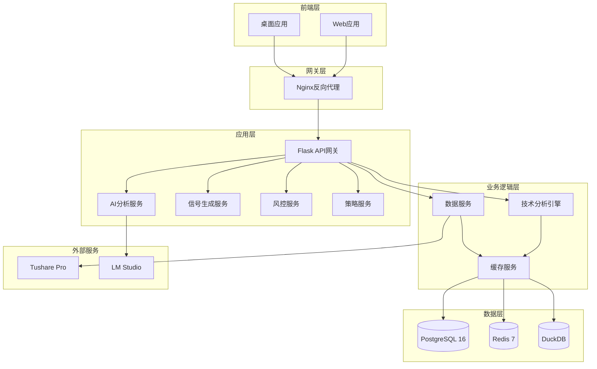
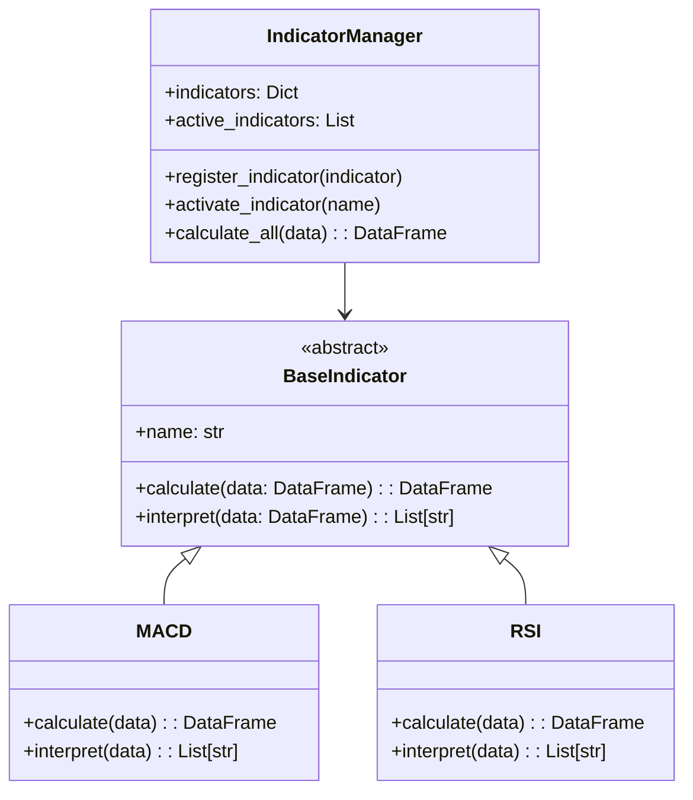
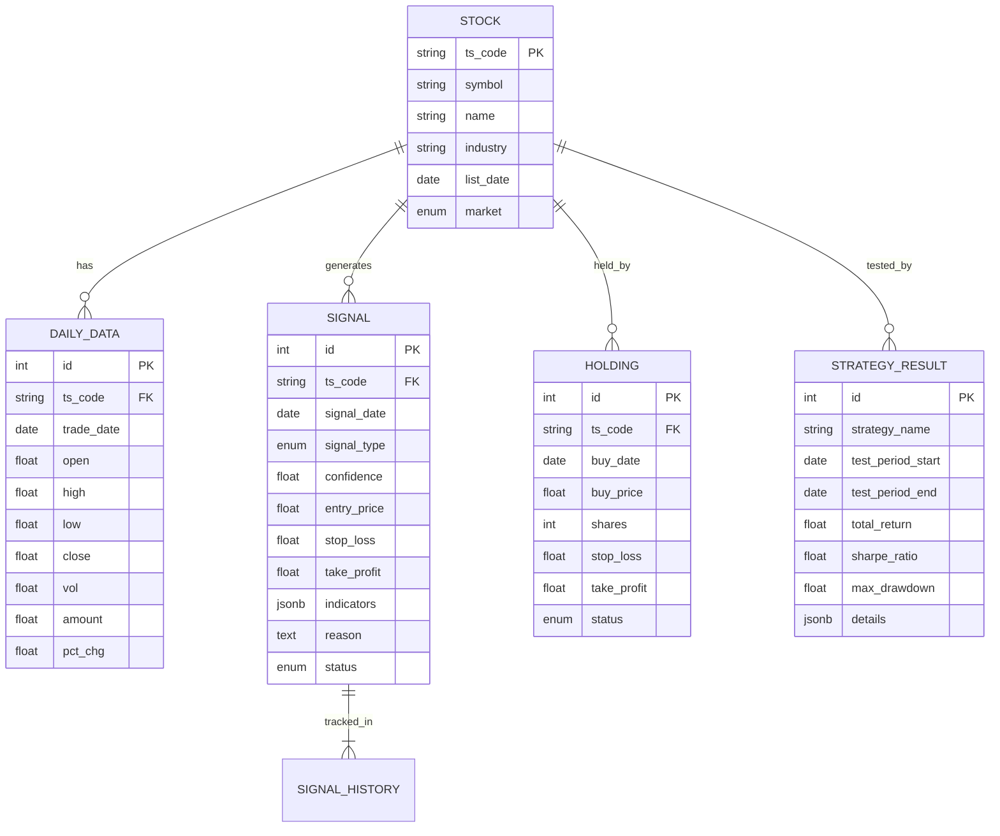

# A股股票分析决策支持系统 - 阶段一：需求分析与架构设计

> **项目编号**：055
> **阶段**：阶段一 - 需求分析与架构设计
> **制定日期**：2026-05-19
> **方案编号**：056

---

## 目录

1. [项目背景与目标](#1-项目背景与目标)
2. [用户需求分析](#2-用户需求分析)
3. [系统架构设计](#3-系统架构设计)
4. [技术选型方案](#4-技术选型方案)
5. [功能模块设计](#5-功能模块设计)
6. [数据库设计](#6-数据库设计)
7. [API接口设计](#7-api接口设计)
8. [前端UI设计](#8-前端ui设计)
9. [项目目录结构](#9-项目目录结构)
10. [开发计划细化](#10-开发计划细化)
11. [验收标准](#11-验收标准)

---

## 1. 项目背景与目标

### 1.1 项目背景

当前项目位于 `/Users/kalence/Desktop/测试/stock_analyzer_desktop/`，是一个基于Tauri框架的股票分析桌面应用。为了更好地服务A股市场用户，提升系统的专业性和易用性，计划基于QuantDinger项目架构，设计开发一个专为中国A股市场定制的股票分析决策支持系统。

### 1.2 项目目标

| 目标 | 说明 | 优先级 |
|------|------|--------|
| **专业性** | 提供专业级的A股技术分析和AI智能解读 | P0 |
| **易用性** | 简洁直观的用户界面，符合国内用户习惯 | P0 |
| **实时性** | 实时市场数据和信号推送 | P1 |
| **安全性** | 本地数据处理，保护用户隐私 | P1 |
| **可扩展性** | 模块化设计，支持功能扩展 | P2 |

### 1.3 与现有系统的关系

```
现有系统 (Stock Analyzer Desktop)
    ↓
    ├─ 达尔文筛选系统 (已完成)
    ├─ 多智能体分析 (已完成)
    ├─ 策略回测 (已完成)
    └─ Tushare数据获取 (已完成)
            ↓
    新项目：A股股票分析决策支持系统
            ↓
    ├─ 技术分析IDE (新增)
    ├─ 信号监控系统 (新增)
    ├─ AI分析助手 (升级)
    ├─ 风控中心 (新增)
    └─ 策略分析系统 (预留)
```

---

## 2. 用户需求分析

### 2.1 目标用户画像

| 用户类型 | 特点 | 核心需求 |
|---------|------|---------|
| **价值投资者** | 关注基本面，注重长期收益 | 财务分析、估值指标、AI解读 |
| **技术分析者** | 关注K线形态和技术指标 | 指标系统、信号提示、K线图 |
| **短线交易者** | 追求短期收益，关注热点 | 实时信号、止损止盈、快速操作 |
| **新手用户** | 缺乏经验，需要指导 | AI建议、风控提示、学习资源 |

### 2.2 核心功能需求

#### 2.2.1 技术分析需求

- **K线图表展示**：支持日、周、月多周期K线
- **技术指标计算**：MACD、RSI、KDJ、布林带等20+指标
- **指标叠加**：多个指标同时显示，自定义颜色和参数
- **买卖信号标记**：在K线图上标记买入/卖出点

#### 2.2.2 AI智能分析需求

- **技术面解读**：解释技术指标的含义和信号
- **信号逻辑说明**：为什么给出买入/卖出建议
- **操作建议生成**：具体的买入价、止损价、目标价
- **风险提示**：提醒T+1规则、涨跌停风险等

#### 2.2.3 信号监控需求

- **实时信号推送**：符合条件的股票即时提醒
- **自选股监控**：重点关注股票的信号变化
- **信号历史记录**：查看历史信号的执行情况
- **信号筛选**：按类型、置信度、市场筛选信号

#### 2.2.4 风控管理需求

- **仓位计算器**：根据资金和风险偏好计算仓位
- **止损止盈工具**：自动计算合理的止损止盈位
- **风险评估**：综合评分和分散度分析
- **规则提醒**：T+1、涨跌停、ST股等特殊规则提示

---

## 3. 系统架构设计

### 3.1 整体架构图



### 3.2 架构设计原则

| 原则 | 说明 | 实现方式 |
|------|------|---------|
| **分层清晰** | 前后端分离，层次分明 | Vue3 + Flask |
| **模块独立** | 各模块高内聚低耦合 | Blueprint路由 |
| **接口稳定** | RESTful API，统一返回格式 | JSON格式 |
| **数据独立** | 数据层与业务层分离 | SQLAlchemy ORM |
| **缓存优化** | 多级缓存提升性能 | Redis + DuckDB |

---

## 4. 技术选型方案

### 4.1 前端技术栈

| 技术 | 版本 | 用途 | 选型理由 |
|------|------|------|---------|
| **Vue.js** | 3.4+ | 前端框架 | 渐进式框架，上手简单，生态成熟 |
| **Vite** | 6.x | 构建工具 | 快速的开发服务器和构建优化 |
| **TypeScript** | 5.x | 类型系统 | 更好的代码提示和类型检查 |
| **Tailwind CSS** | 3.x | CSS框架 | 原子化CSS，快速定制UI |
| **ECharts** | 5.4+ | 图表库 | 丰富的图表类型，良好的交互性 |
| **Pinia** | 2.x | 状态管理 | Vue3推荐的状态管理库 |
| **Vue Router** | 4.x | 路由管理 | Vue官方路由解决方案 |
| **Axios** | 1.x | HTTP客户端 | 基于Promise的HTTP请求库 |

### 4.2 后端技术栈

| 技术 | 版本 | 用途 | 选型理由 |
|------|------|------|---------|
| **Python** | 3.11 | 编程语言 | 丰富的数据科学生态 |
| **Flask** | 3.0+ | Web框架 | 轻量灵活，易于扩展 |
| **SQLAlchemy** | 2.0+ | ORM框架 | 强大的数据库抽象层 |
| **PostgreSQL** | 16 | 关系数据库 | 功能强大，性能优秀 |
| **Redis** | 7 | 缓存数据库 | 高性能的键值存储 |
| **DuckDB** | 1.0+ | 分析数据库 | 嵌入式OLAP数据库 |
| **Pandas** | 2.0+ | 数据处理 | 强大的数据分析工具 |
| **TA-Lib** | 0.4+ | 技术指标 | 专业级技术分析库 |

---

## 5. 功能模块设计

### 5.1 分页功能架构

基于QuantDinger项目的模块划分，结合A股市场特点，设计以下分页功能结构：

```
┌─────────────────────────────────────────────────────────┐
│                    功能导航结构                          │
├─────────────────────────────────────────────────────────┤
│                                                         │
│  📊 核心功能                                            │
│     ├─ 📈 仪表盘 (Dashboard)                          │
│     ├─ 📊 指标分析 (Analysis IDE)                     │
│     ├─ 🎯 信号监控 (Signal Monitor)                   │
│     ├─ 🤖 AI分析 (AI Assistant)                       │
│     └─ 🛡️ 风控中心 (Risk Control)                    │
│                                                         │
│  📦 数据管理                                            │
│     ├─ 💼 自选股管理 (Watchlist)                      │
│     ├─ 📄 报告中心 (Reports)                          │
│     └─ 📜 历史记录 (History)                          │
│                                                         │
│  🔬 策略分析 (预留)                                    │
│     ├─ ⚙️ 策略回测 (Backtest)                        │
│     ├─ ⚗️ 参数优化 (Optimization)                    │
│     └─ ⚖️ 策略对比 (Comparison)                       │
│                                                         │
│  ⚙️ 系统设置                                            │
│     ├─ 🔧 偏好设置 (Preferences)                      │
│     └─ 📊 数据管理 (Data Management)                  │
│                                                         │
└─────────────────────────────────────────────────────────┘
```

### 5.2 核心功能模块详情

#### 5.2.1 仪表盘 (Dashboard)

| 功能 | 说明 | 优先级 |
|------|------|--------|
| 市场概览 | 上证、深证、创业板指数实时数据 | P0 |
| 信号汇总 | 今日买入/卖出信号统计 | P0 |
| 热门股票 | 涨幅榜、跌幅榜、成交量榜 | P1 |
| 快速入口 | 常用功能快捷访问 | P1 |

#### 5.2.2 指标分析 (Analysis IDE)

| 功能 | 说明 | 优先级 |
|------|------|--------|
| K线图表 | 日/周/月周期，支持缩放拖拽 | P0 |
| 技术指标 | MACD/RSI/KDJ等20+指标 | P0 |
| 指标叠加 | 多指标同时显示 | P1 |
| 信号标记 | K线图标记买卖点 | P1 |

#### 5.2.3 信号监控 (Signal Monitor)

| 功能 | 说明 | 优先级 |
|------|------|--------|
| 实时信号 | 股票信号即时推送 | P0 |
| 信号筛选 | 按类型、置信度筛选 | P1 |
| 自选监控 | 自选股信号跟踪 | P0 |
| 历史信号 | 查看历史信号记录 | P1 |

#### 5.2.4 AI分析 (AI Assistant)

| 功能 | 说明 | 优先级 |
|------|------|--------|
| 智能对话 | 自然语言交互分析 | P0 |
| 信号解读 | AI解释信号逻辑 | P0 |
| 操作建议 | 生成具体操作建议 | P0 |
| 风险提示 | A股规则提醒 | P1 |

#### 5.2.5 风控中心 (Risk Control)

| 功能 | 说明 | 优先级 |
|------|------|--------|
| 仓位计算 | 根据风险偏好计算仓位 | P0 |
| 止损止盈 | 自动计算止损止盈位 | P0 |
| 风险评估 | 组合风险评分 | P1 |
| 规则提醒 | T+1、涨跌停等提示 | P1 |

### 5.3 策略分析预留模块 (Phase 2)

#### 5.3.1 策略回测 (Backtest) - 预留

| 功能 | 说明 | 优先级 |
|------|------|--------|
| 历史回测 | 基于历史数据回测策略 | P0 |
| 绩效分析 | 夏普比率、最大回撤等 | P0 |
| 参数调整 | 策略参数优化 | P1 |
| 报告生成 | 回测报告导出 | P1 |

#### 5.3.2 参数优化 (Optimization) - 预留

| 功能 | 说明 | 优先级 |
|------|------|--------|
| 参数扫描 | 多参数网格搜索 | P1 |
| 遗传算法 | 智能参数优化 | P2 |
| 结果对比 | 不同参数组合对比 | P1 |

#### 5.3.3 策略对比 (Comparison) - 预留

| 功能 | 说明 | 优先级 |
|------|------|--------|
| 多策略对比 | 不同策略绩效对比 | P1 |
| 统计检验 | 策略显著性检验 | P2 |
| 相关性分析 | 策略间相关性 | P2 |

### 5.4 技术分析引擎

#### 5.4.1 模块架构



#### 5.4.2 核心指标清单

| 指标名称 | 英文名 | 类别 | 实现优先级 |
|---------|-------|------|----------|
| 移动平均线 | MA | 趋势类 | P0 |
| MACD | MACD | 趋势类 | P0 |
| 相对强弱指数 | RSI | 振荡类 | P0 |
| KDJ | KDJ | 振荡类 | P0 |
| 布林带 | BOLL | 趋势类 | P0 |
| 成交量 | VOL | 能量类 | P0 |
| 威廉指标 | WR | 振荡类 | P1 |
| CCI顺势指标 | CCI | 振荡类 | P1 |
| DMA | DMA | 趋势类 | P1 |
| VR | VR | 能量类 | P2 |

### 5.5 信号生成系统

#### 5.5.1 信号类型定义

| 信号类型 | 英文 | 触发条件 | 优先级 |
|---------|------|---------|--------|
| 强烈买入 | Strong Buy | 置信度≥90% | 1 |
| 买入 | Buy | 置信度70%-90% | 2 |
| 观望 | Hold | 置信度40%-70% | 3 |
| 卖出 | Sell | 置信度30%-40% | 4 |
| 强烈卖出 | Strong Sell | 置信度<30% | 5 |

#### 5.5.2 置信度评分算法

```python
def calculate_confidence(df, indicators):
    """
    综合多指标计算置信度
    
    参数:
        df: 包含技术指标数据的DataFrame
        indicators: 激活的指标列表
    
    返回:
        confidence: 0-100的置信度评分
        signals: 各指标的信号列表
    """
    score = 0
    signals = []
    
    # MACD信号
    if df['MACD'].iloc[-1] > df['MACD_signal'].iloc[-1]:
        score += 25
        signals.append('MACD多头')
    else:
        score -= 25
        signals.append('MACD空头')
    
    # RSI信号
    if df['RSI'].iloc[-1] < 30:
        score += 20
        signals.append('RSI超卖')
    elif df['RSI'].iloc[-1] > 70:
        score -= 20
        signals.append('RSI超买')
    
    # KDJ信号
    if df['KDJ_K'].iloc[-1] > df['KDJ_D'].iloc[-1]:
        score += 20
        signals.append('KDJ金叉')
    else:
        score -= 20
        signals.append('KDJ死叉')
    
    # 布林带信号
    if df['close'].iloc[-1] <= df['BB_lower'].iloc[-1]:
        score += 15
        signals.append('触及布林下轨')
    elif df['close'].iloc[-1] >= df['BB_upper'].iloc[-1]:
        score -= 15
        signals.append('触及布林上轨')
    
    # 均线系统信号
    if df['MA5'].iloc[-1] > df['MA10'].iloc[-1] > df['MA20'].iloc[-1]:
        score += 20
        signals.append('均线多头排列')
    elif df['MA5'].iloc[-1] < df['MA10'].iloc[-1] < df['MA20'].iloc[-1]:
        score -= 20
        signals.append('均线空头排列')
    
    # 转换为0-100的置信度
    confidence = max(0, min(100, 50 + score))
    
    return confidence, signals
```

---

## 6. 数据库设计

### 6.1 ER图



### 6.2 数据表设计

#### 6.2.1 股票基础信息表 (stocks)

```sql
CREATE TABLE stocks (
    ts_code VARCHAR(10) PRIMARY KEY,
    symbol VARCHAR(10) NOT NULL UNIQUE,
    name VARCHAR(50) NOT NULL,
    industry VARCHAR(50),
    market VARCHAR(20),
    list_date DATE,
    created_at TIMESTAMP DEFAULT CURRENT_TIMESTAMP,
    updated_at TIMESTAMP DEFAULT CURRENT_TIMESTAMP
);

CREATE INDEX idx_stocks_industry ON stocks(industry);
CREATE INDEX idx_stocks_market ON stocks(market);
```

#### 6.2.2 日线数据表 (daily_data)

```sql
CREATE TABLE daily_data (
    id SERIAL PRIMARY KEY,
    ts_code VARCHAR(10) NOT NULL,
    trade_date DATE NOT NULL,
    open DECIMAL(10, 2),
    high DECIMAL(10, 2),
    low DECIMAL(10, 2),
    close DECIMAL(10, 2),
    vol DECIMAL(20, 2),
    amount DECIMAL(20, 2),
    pct_chg DECIMAL(10, 2),
    UNIQUE(ts_code, trade_date)
);

CREATE INDEX idx_daily_ts_code ON daily_data(ts_code);
CREATE INDEX idx_daily_date ON daily_data(trade_date);
CREATE INDEX idx_daily_ts_date ON daily_data(ts_code, trade_date);
```

#### 6.2.3 信号记录表 (signals)

```sql
CREATE TABLE signals (
    id SERIAL PRIMARY KEY,
    ts_code VARCHAR(10) NOT NULL,
    signal_date TIMESTAMP DEFAULT CURRENT_TIMESTAMP,
    signal_type VARCHAR(20) NOT NULL,
    confidence DECIMAL(5, 2),
    entry_price DECIMAL(10, 2),
    stop_loss DECIMAL(10, 2),
    take_profit DECIMAL(10, 2),
    indicators JSONB,
    reason TEXT,
    status VARCHAR(20) DEFAULT 'pending',
    created_at TIMESTAMP DEFAULT CURRENT_TIMESTAMP,
    updated_at TIMESTAMP DEFAULT CURRENT_TIMESTAMP
);

CREATE INDEX idx_signals_ts_code ON signals(ts_code);
CREATE INDEX idx_signals_date ON signals(signal_date);
CREATE INDEX idx_signals_type ON signals(signal_type);
CREATE INDEX idx_signals_status ON signals(status);
```

#### 6.2.4 策略回测结果表 (strategy_results) - 预留

```sql
CREATE TABLE strategy_results (
    id SERIAL PRIMARY KEY,
    strategy_name VARCHAR(100) NOT NULL,
    strategy_params JSONB,
    test_start_date DATE,
    test_end_date DATE,
    total_return DECIMAL(10, 4),
    annual_return DECIMAL(10, 4),
    sharpe_ratio DECIMAL(10, 4),
    max_drawdown DECIMAL(10, 4),
    win_rate DECIMAL(5, 2),
    total_trades INTEGER,
    details JSONB,
    created_at TIMESTAMP DEFAULT CURRENT_TIMESTAMP
);

CREATE INDEX idx_strategy_name ON strategy_results(strategy_name);
CREATE INDEX idx_strategy_date ON strategy_results(test_start_date, test_end_date);
```

---

## 7. API接口设计

### 7.1 API规范

#### 7.1.1 基础规范

- **Base URL**: `/api/v1`
- **认证方式**: Bearer Token
- **Content-Type**: `application/json`
- **字符编码**: UTF-8

#### 7.1.2 统一响应格式

```json
{
  "success": true,
  "data": { ... },
  "message": "操作成功",
  "timestamp": 1716100000
}
```

```json
{
  "success": false,
  "error": {
    "code": "VALIDATION_ERROR",
    "message": "参数验证失败",
    "details": [...]
  },
  "timestamp": 1716100000
}
```

### 7.2 核心API接口

#### 7.2.1 市场数据API

| 接口 | 方法 | 说明 | 参数 |
|------|------|------|------|
| `/api/v1/stocks` | GET | 获取股票列表 | page, page_size, industry |
| `/api/v1/stocks/{ts_code}` | GET | 获取股票详情 | - |
| `/api/v1/stocks/{ts_code}/daily` | GET | 获取日线数据 | start_date, end_date |
| `/api/v1/stocks/{ts_code}/realtime` | GET | 获取实时行情 | - |

#### 7.2.2 技术分析API

| 接口 | 方法 | 说明 | 参数 |
|------|------|------|------|
| `/api/v1/analysis/{ts_code}/indicators` | GET | 获取技术指标 | indicators, period |
| `/api/v1/analysis/{ts_code}/signals` | POST | 生成交易信号 | indicators |
| `/api/v1/analysis/{ts_code}/backtest` | POST | 回测信号效果 | start_date, end_date |

#### 7.2.3 AI分析API

| 接口 | 方法 | 说明 | 参数 |
|------|------|------|------|
| `/api/v1/ai/analyze` | POST | AI综合分析 | ts_code, focus |
| `/api/v1/ai/explain` | POST | 解释信号逻辑 | signal_id |
| `/api/v1/ai/suggest` | POST | 生成操作建议 | ts_code, position |

#### 7.2.4 风控API

| 接口 | 方法 | 说明 | 参数 |
|------|------|------|------|
| `/api/v1/risk/calculate` | POST | 计算仓位 | capital, price, risk |
| `/api/v1/risk/stoploss` | POST | 计算止损止盈 | entry_price, strategy |
| `/api/v1/risk/portfolio` | GET | 组合风险评估 | - |

#### 7.2.5 策略分析API (预留)

| 接口 | 方法 | 说明 | 参数 |
|------|------|------|------|
| `/api/v1/strategy/backtest` | POST | 执行回测 | strategy, params |
| `/api/v1/strategy/optimize` | POST | 参数优化 | strategy, param_grid |
| `/api/v1/strategy/compare` | GET | 策略对比 | strategy_ids |

---

## 8. 前端UI设计

### 8.1 分页导航设计

基于QuantDinger项目的模块划分，设计以下分页导航结构：

```
┌─────────────────────────────────────────────────────────┐
│  📊 A股分析系统                                          │
├──────────┬──────────────────────────────────────────────┤
│          │                                              │
│  核心功能 │  📈 仪表盘                                   │
│  ──────  │  市场概览、信号汇总、快速入口                  │
│  📈 仪表盘 │                                              │
│  📊 指标分析│  📊 指标分析                                 │
│  🎯 信号监控│  K线图表、技术指标、指标叠加                 │
│  🤖 AI分析 │                                              │
│  🛡️ 风控中心│  🎯 信号监控                                │
│          │  实时信号、信号筛选、自选监控                   │
│  数据管理 │                                              │
│  ──────  │  🤖 AI分析                                    │
│  💼 自选股 │  智能对话、信号解读、操作建议                 │
│  📄 报告   │                                              │
│  📜 历史   │  🛡️ 风控中心                                │
│          │  仓位计算、止损止盈、风险评估                   │
│  策略分析 │                                              │
│  ──────  │  💼 自选股管理                               │
│  🔬 策略回测│  自选股列表、添加删除                       │
│  ⚗️ 参数优化│                                              │
│  ⚖️ 策略对比│  📄 报告中心                                │
│          │  分析报告、导出功能                            │
│  系统设置 │                                              │
│  ──────  │  📜 历史记录                                 │
│  ⚙️ 设置  │  信号历史、操作记录                          │
│          │                                              │
│          │  🔬 策略回测 (预留)                          │
│          │  历史回测、绩效分析                           │
│          │                                              │
│          │  ⚗️ 参数优化 (预留)                          │
│          │  参数扫描、遗传算法优化                       │
│          │                                              │
│          │  ⚖️ 策略对比 (预留)                          │
│          │  多策略对比、统计检验                         │
│          │                                              │
└──────────┴──────────────────────────────────────────────┘
```

### 8.2 设计规范

#### 8.2.1 色彩系统

| 颜色 | 色值 | 用途 |
|------|------|------|
| 主色 | #0A1628 | 背景、导航 |
| 辅助色 | #1E293B | 卡片、面板 |
| 强调色-涨 | #22C55E | 上涨、买入信号 |
| 强调色-跌 | #EF4444 | 下跌、卖出信号 |
| 警告色 | #F59E0B | 警示、注意 |
| 信息色 | #3B82F6 | 信息、链接 |
| 文字主色 | #FFFFFF | 标题、重要文字 |
| 文字次色 | #94A3B8 | 副标题、说明文字 |
| 文字弱色 | #64748B | 提示、辅助文字 |

#### 8.2.2 字体系统

| 字体 | 用途 | 备选 |
|------|------|------|
| 主字体 | 界面文字 | PingFang SC, Microsoft YaHei |
| 数据字体 | 数字、代码 | JetBrains Mono, Consolas |
| 标题字体 | 大标题 | Inter, -apple-system |

#### 8.2.3 间距系统

| 尺寸 | 数值 | 用途 |
|------|------|------|
| xs | 4px | 紧凑间距 |
| sm | 8px | 小间距 |
| md | 16px | 标准间距 |
| lg | 24px | 大间距 |
| xl | 32px | 区块间距 |
| 2xl | 48px | 页面间距 |

### 8.3 核心页面设计

#### 8.3.1 仪表盘页面

- **布局**：四象限卡片布局
- **内容**：
  - 左上：市场指数（上证、深证、创业板）
  - 右上：今日信号汇总
  - 左下：热门股票（涨幅榜、跌幅榜、成交量榜）
  - 右下：快速操作入口

#### 8.3.2 指标分析IDE页面

- **布局**：左-中-右三栏布局
- **内容**：
  - 左侧：股票搜索、自选股列表
  - 中间：K线图表（支持日/周/月切换、缩放拖拽）
  - 右侧：指标面板、信号显示

#### 8.3.3 信号监控页面

- **布局**：列表式布局
- **内容**：
  - 顶部：筛选条件（信号类型、时间范围）
  - 中间：信号卡片列表
  - 底部：分页控件

#### 8.3.4 AI分析助手页面

- **布局**：左-右双栏布局
- **内容**：
  - 左侧：聊天界面（类似ChatGPT）
  - 右侧：结构化分析结果展示

#### 8.3.5 风控中心页面

- **布局**：上-下双区布局
- **内容**：
  - 上部：仓位计算器、止损止盈计算器
  - 下部：风险仪表盘、持仓管理

#### 8.3.6 策略分析页面（预留）

- **布局**：表单+结果展示布局
- **内容**：
  - 左侧：策略参数配置
  - 右侧：回测结果图表、绩效指标

---

## 9. 项目目录结构

### 9.1 整体目录结构

```
stock_analysis_system/
├── docker-compose.yml              # Docker Compose配置
├── .env.example                   # 环境变量模板
├── .gitignore                    # Git忽略规则
├── requirements.txt               # Python依赖
├── README.md                    # 项目说明
│
├── backend/                      # 后端服务
│   ├── Dockerfile
│   ├── gunicorn_config.py
│   ├── run.py                   # 应用入口
│   ├── app/
│   │   ├── __init__.py
│   │   ├── config.py            # 配置管理
│   │   ├── extensions.py        # Flask扩展
│   │   ├── errors.py           # 错误处理
│   │   │
│   │   ├── routes/              # API路由
│   │   │   ├── __init__.py
│   │   │   ├── market.py
│   │   │   ├── analysis.py
│   │   │   ├── signals.py
│   │   │   ├── risk.py
│   │   │   ├── ai.py
│   │   │   ├── report.py
│   │   │   ├── strategy.py      # 预留
│   │   │   └── health.py
│   │   │
│   │   ├── services/            # 业务逻辑
│   │   │   ├── __init__.py
│   │   │   ├── market_service.py
│   │   │   ├── analysis_service.py
│   │   │   ├── signal_service.py
│   │   │   ├── risk_service.py
│   │   │   ├── ai_service.py
│   │   │   ├── report_service.py
│   │   │   └── strategy_service.py  # 预留
│   │   │
│   │   ├── models/              # 数据模型
│   │   │   ├── __init__.py
│   │   │   ├── stock.py
│   │   │   ├── daily_data.py
│   │   │   ├── signal.py
│   │   │   ├── holding.py
│   │   │   └── strategy_result.py  # 预留
│   │   │
│   │   ├── analysis/             # 技术分析
│   │   │   ├── __init__.py
│   │   │   ├── base_indicator.py
│   │   │   ├── indicator_manager.py
│   │   │   └── indicators/
│   │   │       ├── __init__.py
│   │   │       ├── macd.py
│   │   │       ├── rsi.py
│   │   │       ├── kdj.py
│   │   │       ├── bollinger.py
│   │   │       ├── ma.py
│   │   │       └── volume.py
│   │   │
│   │   ├── signals/              # 信号生成
│   │   │   ├── __init__.py
│   │   │   ├── signal_generator.py
│   │   │   └── pattern_recognition.py
│   │   │
│   │   ├── risk/                # 风控模块
│   │   │   ├── __init__.py
│   │   │   ├── position_manager.py
│   │   │   └── stop_loss_take_profit.py
│   │   │
│   │   ├── strategy/            # 策略分析（预留）
│   │   │   ├── __init__.py
│   │   │   ├── backtest_engine.py
│   │   │   ├── parameter_optimizer.py
│   │   │   └── strategy_compare.py
│   │   │
│   │   ├── data/                # 数据获取
│   │   │   ├── __init__.py
│   │   │   ├── tushare_provider.py
│   │   │   ├── akshare_provider.py
│   │   │   └── data_manager.py
│   │   │
│   │   ├── utils/                # 工具函数
│   │   │   ├── __init__.py
│   │   │   ├── decorators.py
│   │   │   ├── validators.py
│   │   │   ├── formatters.py
│   │   │   └── date_utils.py
│   │   │
│   │   └── schemas/              # 请求/响应模型
│   │       ├── __init__.py
│   │       ├── market.py
│   │       ├── analysis.py
│   │       ├── signal.py
│   │       ├── risk.py
│   │       └── strategy.py  # 预留
│   │
│   ├── migrations/               # 数据库迁移
│   │   └── init.sql
│   │
│   └── tests/                   # 测试
│       ├── __init__.py
│       ├── conftest.py
│       ├── test_analysis.py
│       ├── test_signals.py
│       ├── test_risk.py
│       └── test_strategy.py  # 预留
│
├── frontend/                     # 前端项目
│   ├── Dockerfile
│   ├── nginx.conf
│   ├── package.json
│   ├── vite.config.ts
│   ├── tsconfig.json
│   ├── tailwind.config.js
│   ├── postcss.config.js
│   │
│   ├── public/                   # 静态资源
│   │   ├── favicon.ico
│   │   └── logo.png
│   │
│   └── src/                      # 源码
│       ├── main.ts
│       ├── App.vue
│       ├── router.ts
│       │
│       ├── api/                   # API调用
│       │   ├── index.ts
│       │   ├── market.ts
│       │   ├── analysis.ts
│       │   ├── signals.ts
│       │   ├── risk.ts
│       │   ├── ai.ts
│       │   └── strategy.ts  # 预留
│       │
│       ├── stores/                # Pinia状态
│       │   ├── index.ts
│       │   ├── market.ts
│       │   ├── signals.ts
│       │   ├── user.ts
│       │   └── strategy.ts  # 预留
│       │
│       ├── views/                 # 页面视图
│       │   ├── Dashboard.vue
│       │   ├── AnalysisIDE.vue
│       │   ├── Signals.vue
│       │   ├── AIAssistant.vue
│       │   ├── RiskControl.vue
│       │   ├── Watchlist.vue
│       │   ├── Reports.vue
│       │   ├── History.vue
│       │   ├── StrategyBacktest.vue    # 预留
│       │   ├── StrategyOptimize.vue    # 预留
│       │   ├── StrategyCompare.vue     # 预留
│       │   └── Settings.vue
│       │
│       ├── components/           # 组件库
│       │   ├── common/
│       │   │   ├── Button.vue
│       │   │   ├── Card.vue
│       │   │   ├── Badge.vue
│       │   │   ├── Modal.vue
│       │   │   └── Loading.vue
│       │   │
│       │   ├── charts/
│       │   │   ├── KLineChart.vue
│       │   │   ├── IndicatorChart.vue
│       │   │   └── LineChart.vue
│       │   │
│       │   ├── signals/
│       │   │   ├── SignalBadge.vue
│       │   │   ├── SignalCard.vue
│       │   │   └── SignalList.vue
│       │   │
│       │   └── risk/
│       │       ├── RiskMeter.vue
│       │       ├── PositionCalculator.vue
│       │       └── StopLossTakeProfit.vue
│       │
│       ├── composables/           # 组合式函数
│       │   ├── useApi.ts
│       │   ├── useChart.ts
│       │   └── useRisk.ts
│       │
│       ├── utils/                 # 工具函数
│       │   ├── formatters.ts
│       │   ├── validators.ts
│       │   └── constants.ts
│       │
│       ├── styles/                # 样式
│       │   ├── variables.css
│       │   ├── base.css
│       │   └── components.css
│       │
│       └── types/                 # TypeScript类型
│           ├── api.d.ts
│           ├── market.d.ts
│           ├── analysis.d.ts
│           ├── risk.d.ts
│           └── strategy.d.ts  # 预留
│
├── data/                         # 数据存储
│   ├── postgres/                  # PostgreSQL数据
│   ├── redis/                     # Redis数据
│   ├── duckdb/                    # DuckDB缓存
│   │   └── stock_cache.db
│   └── reports/                   # 报告文件
│
└── docs/                         # 文档
    ├── deployment.md
    ├── api.md
    └── guide.md
```

---

## 10. 开发计划细化

### 10.1 阶段一详细任务（1周）

#### 10.1.1 任务分配

| 任务 | 负责人 | 预计时间 | 依赖 |
|------|-------|---------|------|
| 项目结构初始化 | AI助手 | 4h | - |
| Docker Compose配置 | AI助手 | 2h | 项目结构 |
| 数据库表设计 | AI助手 | 4h | - |
| 后端基础框架搭建 | AI助手 | 8h | Docker配置 |
| 前端项目初始化 | AI助手 | 4h | 项目结构 |
| 需求文档整理 | AI助手 | 2h | - |
| 代码审查与优化 | AI助手 | 4h | 所有任务 |

#### 10.1.2 里程碑检查点

- ✅ 项目结构创建完成
- ✅ Docker Compose可正常启动
- ✅ 数据库表创建成功
- ✅ 后端API基础路由可用
- ✅ 前端项目可运行
- ✅ 需求文档归档

### 10.2 后续阶段预览

| 阶段 | 内容 | 周期 | 优先级 |
|------|------|------|--------|
| 阶段二 | 数据层开发 | 2周 | P0 |
| 阶段三 | 技术分析引擎 | 3周 | P0 |
| 阶段四 | 风控系统 | 1周 | P1 |
| 阶段五 | AI分析模块 | 2周 | P1 |
| 阶段六 | 前端UI开发 | 3周 | P1 |
| 阶段七 | 测试与部署 | 1周 | P2 |
| 阶段八 | 策略分析模块 | 预留 | P3 |

---

## 11. 验收标准

### 11.1 阶段一验收清单

| 序号 | 验收项 | 验收标准 | 验证方法 |
|------|--------|---------|---------|
| 1 | 项目结构 | 符合设计的目录结构 | 文件检查 |
| 2 | Docker Compose | `docker-compose up` 可启动 | 运行测试 |
| 3 | 数据库连接 | PostgreSQL连接正常 | API测试 |
| 4 | 后端基础路由 | `/api/v1/health` 返回正常 | 接口测试 |
| 5 | 前端页面 | 可访问Dashboard页面 | 浏览器测试 |
| 6 | 文档完整性 | 包含README和API文档 | 文档检查 |

### 11.2 质量标准

- **代码规范**：遵循PEP 8（Python）、Airbnb（JavaScript）
- **测试覆盖**：核心模块测试覆盖≥80%
- **文档完整**：API文档、使用说明齐全
- **性能指标**：API响应时间<500ms（95分位）

### 11.3 交付物清单

1. ✅ 项目源码（Git仓库）
2. ✅ Docker配置文件
3. ✅ 数据库迁移脚本
4. ✅ API接口文档
5. ✅ 部署文档
6. ✅ 需求分析文档（本文档）

---

## 附录

### A. 参考文档

- [052-QuantDinger项目全面研究报告.md](../052-QuantDinger项目全面研究报告.md)
- [053-A股股票分析决策支持系统-完整开发与部署计划.md](../053-A股股票分析决策支持系统-完整开发与部署计划.md)
- [054-A股股票分析决策支持系统-前端UI设计方案.md](../054-A股股票分析决策支持系统-前端UI设计方案.md)
- [055-A股股票分析系统-方案B定制化开发规划.md](../055-A股股票分析系统-方案B定制化开发规划.md)

### B. 技术术语表

| 术语 | 说明 |
|------|------|
| MACD | 指数平滑异同移动平均线 |
| RSI | 相对强弱指数 |
| KDJ | 随机指标 |
| BOLL | 布林带指标 |
| T+1 | 股票当日买，次日才能卖 |
| TA-Lib | 技术分析库 |
| ORM | 对象关系映射 |

### C. 联系方式

如有疑问，请联系项目负责人或查阅项目文档。

---

**文档状态**：已完成（优化版）
**审核状态**：待审核
**版本历史**：
- v1.0 (2026-05-19): 初版完成
- v1.1 (2026-05-19): 优化分页设计，添加策略分析预留
