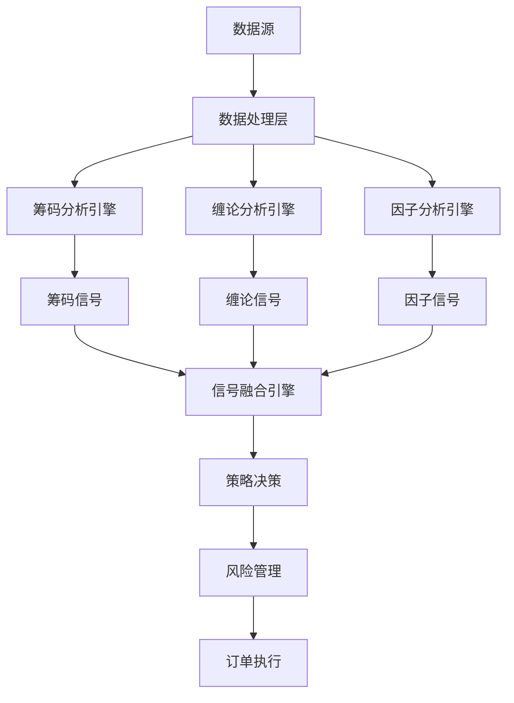

# 缠论体系与量化系统集成优化评估报告

**报告日期**: 2026-05-26  
**参考文档**: 
- [113-量化系统优化升级实施计划.md](002-方案存档/113-量化系统优化升级实施计划.md)
- [缠论量化策略借鉴与实施指南.md](book/缠论量化策略借鉴与实施指南.md)

---

## 一、当前系统架构分析

### 1.1 现有模块化框架

系统已实现基于 QuantConnect/LEAN 的五模块架构：

| 模块 | 实现状态 | 核心功能 |
|------|----------|----------|
| **UniverseSelectionModel** | ✅ 已实现 | 股票池选择 |
| **AlphaModel** | ✅ 已实现 | 信号生成 |
| **PortfolioConstructionModel** | ✅ 已实现 | 组合构建 |
| **RiskManagementModel** | ✅ 已实现 | 风险管理 |
| **ExecutionModel** | ✅ 已实现 | 执行模型 |

### 1.2 现有筹码策略模块

| 组件 | 实现状态 | 说明 |
|------|----------|------|
| `ChipUniverseSelectionModel` | ✅ 已实现 | 筹码股票池筛选 |
| `ChipAlphaModel` | ✅ 已实现 | 筹码信号生成 |
| `ChipRiskManagementModel` | ✅ 已实现 | 筹码风险管理 |
| `ChipScorer` | ✅ 已实现 | 筹码评分器 |

### 1.3 现有缠论实现

系统已实现基础缠论功能：

| 功能 | 实现状态 | 文件位置 |
|------|----------|----------|
| K线包含关系处理 | ✅ 已实现 | `backend/chanlun_demo.py` |
| 顶底分型识别 | ✅ 已实现 | `backend/chanlun_demo.py` |
| 笔的构建 | ✅ 已实现 | `backend/chanlun_demo.py` |
| 线段识别 | ⚠️ 未实现 | - |
| 中枢识别 | ⚠️ 未实现 | - |
| 背驰判断 | ⚠️ 未实现 | - |
| 买卖点识别 | ⚠️ 未实现 | - |

---

## 二、优化评估：缠论与量化系统集成

### 2.1 现有信号融合支持

当前 `SignalFusion` 已配置缠论权重：

```python
self.weights = {
    'chip': 0.4,      # 筹码策略
    'chanlun': 0.3,    # 缠论策略
    'factor': 0.3      # 因子策略
}
```

### 2.2 缺失的关键功能

根据实施计划和缠论指南，系统缺少以下关键功能：

| 优先级 | 缺失功能 | 影响 | 建议 |
|--------|----------|------|------|
| 🔴 高 | 线段识别 | 无法构建中枢 | 实现线段算法 |
| 🔴 高 | 中枢识别 | 无法判断走势类型 | 实现中枢算法 |
| 🔴 高 | 背驰判断 | 无法识别买卖点 | 实现背驰检测 |
| 🔴 高 | 三类买卖点识别 | 无法生成交易信号 | 实现买卖点逻辑 |
| 🟡 中 | 多级别联立 | 无法区间套操作 | 实现跨级别分析 |
| 🟡 中 | 缠论Alpha模型 | 无法集成到框架 | 创建ChanlunAlphaModel |
| 🟢 低 | 缠论可视化 | 难以调试验证 | 添加可视化模块 |

---

## 三、优化建议

### 3.1 创建缠论策略模块

建议创建 `ChanlunStrategy` 模块，实现完整的缠论分析能力：

```python
# chanlun_strategy.py
class ChanlunUniverseSelectionModel(UniverseSelectionModel):
    """缠论视角的股票池选择"""
    
class ChanlunAlphaModel(AlphaModel):
    """缠论信号生成模型"""
    def generate_insights(self, data):
        # 1. 分型识别
        # 2. 笔构建
        # 3. 线段识别
        # 4. 中枢识别
        # 5. 背驰判断
        # 6. 买卖点识别
        # 7. 生成Insight信号

class ChanlunScorer:
    """缠论评分器"""
    def score(self, data):
        # 趋势强度评分
        # 形态质量评分
        # 背驰力度评分
```

### 3.2 增强信号融合机制

当前信号融合仅支持简单加权，建议增强为：

| 增强功能 | 说明 | 优先级 |
|----------|------|--------|
| 动态权重 | 根据市场环境调整权重 | 高 |
| 信号确认 | 多级别信号相互确认 | 高 |
| 时间衰减 | 信号随时间衰减 | 中 |
| 置信度融合 | 综合各策略置信度 | 中 |

### 3.3 多级别联立分析

参考缠论指南中的多级别决策流程：

```python
class MultiLevelAnalyzer:
    def __init__(self, levels=['day', '60min', '15min']):
        self.levels = levels
        
    def analyze(self, symbol, data):
        # 大级别趋势判断（日线）
        # 中级别买卖点（60分钟）
        # 小级别精确入场（15分钟）
        # 跨级别信号确认
```

---

## 四、实施路线图

### 4.1 短期目标（1-2周）

| 任务 | 描述 | 产出物 |
|------|------|--------|
| 线段算法实现 | 实现线段识别逻辑 | `ChanlunAnalyzer.segment_detect()` |
| 中枢算法实现 | 实现中枢识别逻辑 | `ChanlunAnalyzer.zhongshu_detect()` |

### 4.2 中期目标（3-4周）

| 任务 | 描述 | 产出物 |
|------|------|--------|
| 背驰判断实现 | 实现MACD背驰、盘整背驰 | `ChanlunAnalyzer.divergence_detect()` |
| 买卖点识别 | 实现三类买卖点识别 | `ChanlunAnalyzer.buy_sell_points()` |
| 缠论Alpha模型 | 创建ChanlunAlphaModel | `ChanlunAlphaModel`类 |

### 4.3 长期目标（1-2个月）

| 任务 | 描述 | 产出物 |
|------|------|--------|
| 多级别联立 | 实现跨级别分析 | `MultiLevelAnalyzer`类 |
| 参数优化 | 优化缠论参数 | 最优参数集 |
| 回测验证 | 缠论策略回测 | 回测报告 |

---

## 五、集成方案

### 5.1 架构集成图



### 5.2 模块集成代码示例

```python
# framework_integration.py 增强
def create_chanlun_algorithm() -> Algorithm:
    """创建缠论策略算法"""
    algorithm = Algorithm(name="ChanlunStrategy")
    
    algorithm.set_universe_selection(ChanlunUniverseSelectionModel())
    algorithm.set_alpha(ChanlunAlphaModel())
    algorithm.set_portfolio_construction(EqualWeightPortfolioConstruction())
    algorithm.set_risk_management(StopLossRiskManagement())
    
    return algorithm
```

---

## 六、风险评估

### 6.1 技术风险

| 风险 | 描述 | 概率 | 应对措施 |
|------|------|------|----------|
| 算法复杂度 | 缠论算法实现复杂 | 高 | 参考成熟项目（CZSC） |
| 性能问题 | 多级别分析计算量大 | 中 | 使用向量化计算 |
| 数据质量 | 分型识别对数据敏感 | 中 | 数据预处理和验证 |

### 6.2 策略风险

| 风险 | 描述 | 概率 | 应对措施 |
|------|------|------|----------|
| 信号质量 | 缠论信号可能产生假突破 | 中 | 多策略确认 |
| 过拟合 | 参数过度优化 | 中 | 样本外测试 |
| 市场适应性 | 策略可能失效 | 中 | 动态参数调整 |

---

## 七、结论与建议

### 7.1 评估结论

1. **系统基础良好**：已实现完整的模块化框架，支持策略扩展
2. **缠论基础薄弱**：仅实现基础分型和笔，缺少核心的中枢、背驰、买卖点识别
3. **集成路径清晰**：信号融合器已预留缠论接口，可快速接入
4. **风险可控**：可参考成熟项目（如CZSC）降低实现风险

### 7.2 实施建议

1. **优先实现核心功能**：线段、中枢、背驰、买卖点
2. **参考成熟实现**：借鉴CZSC项目的算法实现
3. **保持模块化**：创建独立的ChanlunStrategy模块
4. **充分测试**：在回测环境验证后再实盘使用

### 7.3 预期收益

| 收益项 | 预期效果 |
|--------|----------|
| 信号质量提升 | 多策略融合提高胜率 |
| 策略多样性 | 增加缠论维度的策略 |
| 风险控制 | 多级别确认降低风险 |
| 可扩展性 | 为后续策略扩展奠定基础 |

---

**报告结束**  
**编制人**: AI Assistant  
**编制时间**: 2026-05-26