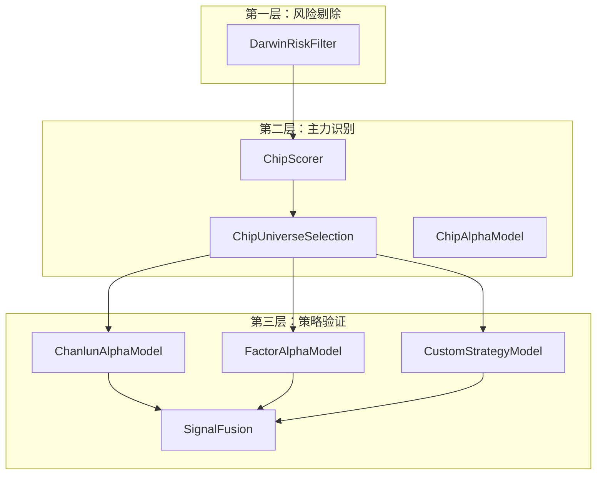

# 缠论体系优化评估报告（修订版）

**报告日期**: 2026-05-26  
**参考文档**: 
- [111-策略框架评估与方案报告.md](002-方案存档/111-策略框架评估与方案报告.md)
- [113-量化系统优化升级实施计划.md](002-方案存档/113-量化系统优化升级实施计划.md)

---

## 一、三层策略框架回顾

根据用户明确的策略框架逻辑：

```
┌─────────────────────────────────────────────────────────────┐
│                    三层策略框架架构                          │
├─────────────────────────────────────────────────────────────┤
│  第一层：风险剔除层（达尔文策略）                            │
│  ├─ ST风险识别                                              │
│  ├─ 财务风险识别                                            │
│  ├─ 流动性风险识别                                          │
│  └─ 估值风险识别                                            │
├─────────────────────────────────────────────────────────────┤
│  第二层：主力识别层（筹码策略）                              │
│  ├─ 筹码分布分析                                            │
│  ├─ 主力阶段识别（建仓/洗盘/拉升/出货）                      │
│  ├─ 主力资金信号确认                                        │
│  └─ 选股评分排序                                            │
├─────────────────────────────────────────────────────────────┤
│  第三层：策略验证层（多策略并行）                            │
│  ├─ 缠论策略分析                                            │
│  ├─ 因子组合策略                                            │
│  ├─ 用户自定义策略                                          │
│  └─ AI综合评估                                            │
└─────────────────────────────────────────────────────────────┘
```

---

## 二、当前实现状态评估

### 2.1 第一层：风险剔除层 ✅ 已完成

| 功能 | 实现状态 | 文件位置 |
|------|----------|----------|
| ST风险过滤 | ✅ 已实现 | `framework/screener.py` |
| 流动性风险过滤 | ✅ 已实现 | `framework/screener.py` |
| 高估值风险过滤 | ✅ 已实现 | `framework/screener.py` |

### 2.2 第二层：主力识别层 ✅ 已完成

| 功能 | 实现状态 | 文件位置 |
|------|----------|----------|
| 筹码分布分析 | ✅ 已实现 | `framework/chip_strategy.py` |
| 主力阶段识别 | ✅ 已实现 | `framework/chip_strategy.py` |
| 选股评分模型 | ✅ 已实现 | `ChipScorer.score()` |
| 股票池筛选 | ✅ 已实现 | `ChipUniverseSelectionModel` |

### 2.3 第三层：策略验证层 ⚠️ 部分实现

| 功能 | 实现状态 | 文件位置 |
|------|----------|----------|
| 缠论策略分析 | ⚠️ 基础实现 | `backend/chanlun_demo.py` |
| 因子组合策略 | ✅ 已实现 | `factors/builtin/` |
| 用户自定义策略 | ✅ 已实现 | `pipeline.py` |
| 信号融合机制 | ✅ 已实现 | `SignalFusion` |

---

## 三、缠论策略现状深度分析

### 3.1 现有缠论实现（基础功能）

```python
# 当前已实现的缠论功能
class ChanlunBasicAnalyzer:
    def __init__(self):
        pass
    
    def merge_contain(self, klines):
        """包含关系处理 ✅"""
        pass
    
    def find_fractals(self, klines):
        """分型识别 ✅"""
        pass
    
    def build_strokes(self, fractals):
        """笔的构建 ✅"""
        pass
```

### 3.2 缺失的关键功能

| 功能 | 重要性 | 说明 |
|------|--------|------|
| **线段识别** | 🔴 高 | 构建中枢的基础 |
| **中枢识别** | 🔴 高 | 判断走势类型的核心 |
| **背驰判断** | 🔴 高 | 三类买卖点识别的关键 |
| **买卖点识别** | 🔴 高 | 生成交易信号的直接依据 |
| **多级别联立** | 🟡 中 | 区间套分析，提高信号质量 |

### 3.3 当前第三层架构缺陷

**问题1：缠论分析未集成到框架**
- 当前缠论代码独立于模块化框架
- 无法参与信号融合和策略验证流程

**问题2：信号融合不完整**
- 当前仅支持简单加权融合
- 未实现多策略确认机制

**问题3：用户自选股分析支持不足**
- 缺乏针对单只股票的完整分析流程

---

## 四、优化方案

### 4.1 创建缠论策略模块

```python
# framework/chanlun_strategy.py - 建议新增
class ChanlunAlphaModel(AlphaModel):
    """缠论信号生成模型 - 第三层策略验证"""
    
    def __init__(self):
        self.analyzer = ChanlunAnalyzer()
    
    def generate_insights(self, data: Dict[str, pd.DataFrame]) -> List[Insight]:
        """
        对筛选后的股票进行缠论分析
        
        Args:
            data: 股票数据 {symbol: DataFrame}
        
        Returns:
            Insight信号列表
        """
        insights = []
        
        for symbol, df in data.items():
            if len(df) < 60:
                continue
            
            # 完整缠论分析
            analysis = self.analyzer.analyze(df)
            
            # 根据分析结果生成信号
            if analysis['buy_signal']:
                insights.append(Insight(
                    symbol=symbol,
                    direction=Insight.LONG,
                    confidence=analysis['confidence'],
                    weight=0.5,
                    reason=self._build_reason(analysis)
                ))
        
        return insights


class ChanlunAnalyzer:
    """完整缠论分析器"""
    
    def analyze(self, df: pd.DataFrame) -> Dict:
        """
        完整缠论分析流程
        
        Returns:
            {
                'fractals': [...],
                'strokes': [...],
                'segments': [...],      # 线段
                'zhongshu': [...],      # 中枢
                'divergence': None/type, # 背驰类型
                'buy_signal': bool,      # 买入信号
                'sell_signal': bool,     # 卖出信号
                'confidence': float      # 置信度
            }
        """
        # 1. 包含处理
        klines = self._merge_contain(df)
        
        # 2. 分型识别
        fractals = self._find_fractals(klines)
        
        # 3. 笔识别
        strokes = self._build_strokes(fractals)
        
        # 4. 线段识别（缺失）
        segments = self._build_segments(strokes)
        
        # 5. 中枢识别（缺失）
        zhongshu = self._find_zhongshu(segments)
        
        # 6. 背驰判断（缺失）
        divergence = self._detect_divergence(zhongshu, df)
        
        # 7. 买卖点识别（缺失）
        buy_signal, sell_signal = self._find_buy_sell_points(
            zhongshu, divergence, strokes
        )
        
        return {
            'fractals': fractals,
            'strokes': strokes,
            'segments': segments,
            'zhongshu': zhongshu,
            'divergence': divergence,
            'buy_signal': buy_signal,
            'sell_signal': sell_signal,
            'confidence': self._calculate_confidence(buy_signal, divergence)
        }
```

### 4.2 增强第三层策略验证流程

```python
# framework/screener.py - 建议增强
class StrategyValidationLayer:
    """第三层：策略验证层"""
    
    def __init__(self):
        self.strategies = {
            'chanlun': ChanlunAlphaModel(),
            'factor': FactorAlphaModel(),
            'custom': CustomStrategyModel()
        }
        
    def validate(self, candidates: List[Dict], stock_data: Dict[str, pd.DataFrame]) -> List[Dict]:
        """
        对候选股票进行多策略验证
        
        Args:
            candidates: 第二层筛选出的股票列表
            stock_data: 完整股票数据
        
        Returns:
            通过验证的股票列表
        """
        validated = []
        
        for candidate in candidates:
            symbol = candidate['symbol']
            data = stock_data.get(symbol)
            
            if data is None or len(data) < 60:
                continue
            
            # 多策略并行分析
            signals = {}
            for strategy_name, strategy in self.strategies.items():
                try:
                    insights = strategy.generate_insights({symbol: data})
                    if insights:
                        signals[strategy_name] = {
                            'signal': insights[0].direction,
                            'confidence': insights[0].confidence
                        }
                except Exception as e:
                    print(f"策略 {strategy_name} 分析 {symbol} 失败: {e}")
            
            # 信号融合
            fusion_result = self._fuse_signals(signals)
            
            if fusion_result['action'] == 'BUY':
                validated.append({
                    **candidate,
                    'signals': signals,
                    'fusion_result': fusion_result
                })
        
        return validated
    
    def _fuse_signals(self, signals: Dict) -> Dict:
        """信号融合逻辑"""
        # 简单规则：至少2个策略发出买入信号才确认
        buy_count = sum(1 for s in signals.values() if s['signal'] == Insight.LONG)
        
        if buy_count >= 2:
            avg_confidence = sum(s['confidence'] for s in signals.values()) / len(signals)
            return {'action': 'BUY', 'confidence': avg_confidence}
        
        return {'action': 'HOLD', 'confidence': 0.0}
```

### 4.3 用户自选股分析支持

```python
# framework_integration.py - 建议增强
class FrameworkIntegration:
    def analyze_single_stock(self, symbol: str, data: pd.DataFrame) -> Dict:
        """
        单只股票完整分析（支持用户自选股）
        
        Args:
            symbol: 股票代码
            data: K线数据
        
        Returns:
            完整分析报告
        """
        analysis = {
            'symbol': symbol,
            'risk_check': None,
            'chip_analysis': None,
            'strategy_validation': None
        }
        
        # 第一层：风险检查
        risk_filter = DarwinRiskFilter()
        passed = risk_filter.filter([symbol], {symbol: data})
        analysis['risk_check'] = {
            'passed': len(passed) > 0,
            'reasons': []  # 风险原因
        }
        
        # 第二层：筹码分析
        chip_scorer = ChipScorer()
        analysis['chip_analysis'] = {
            'score': chip_scorer.score(data),
            'phase': self._detect_phase(data)
        }
        
        # 第三层：策略验证
        validation_layer = StrategyValidationLayer()
        result = validation_layer.validate(
            [{'symbol': symbol, 'score': analysis['chip_analysis']['score']}],
            {symbol: data}
        )
        analysis['strategy_validation'] = result[0] if result else None
        
        return analysis
```

---

## 五、实施优先级

### 5.1 短期优先级（1-2周）

| 优先级 | 任务 | 说明 |
|--------|------|------|
| 🔴 高 | 线段识别算法 | 中枢识别的基础 |
| 🔴 高 | 中枢识别算法 | 判断走势类型核心 |
| 🔴 高 | 背驰判断算法 | 买卖点识别关键 |
| 🟡 中 | 买卖点识别 | 生成交易信号 |

### 5.2 中期优先级（3-4周）

| 优先级 | 任务 | 说明 |
|--------|------|------|
| 🟡 中 | ChanlunAlphaModel | 集成到框架 |
| 🟡 中 | StrategyValidationLayer | 第三层策略验证 |
| 🟡 中 | 信号融合增强 | 多策略确认机制 |
| 🟢 低 | 用户自选股分析 | 单股票完整分析流程 |

---

## 六、与现有框架的集成方案

### 6.1 模块集成图



### 6.2 完整筛选流程

```python
def complete_screening_pipeline(all_stocks: List[str], stock_data: Dict[str, pd.DataFrame]) -> List[Dict]:
    """
    完整的三层筛选流程
    
    Returns:
        最终精选股票列表
    """
    # 第一层：风险剔除
    layer1 = DarwinRiskFilter()
    layer1_results = layer1.filter(all_stocks, stock_data)
    
    # 第二层：主力识别
    screener = MultiLayerStockScreener()
    layer2_results = screener.screen(layer1_results, stock_data)
    
    # 第三层：策略验证
    validator = StrategyValidationLayer()
    final_results = validator.validate(layer2_results, stock_data)
    
    return final_results
```

---

## 七、风险评估

### 7.1 技术风险

| 风险 | 描述 | 应对措施 |
|------|------|----------|
| 缠论算法复杂度 | 线段、中枢、背驰算法实现复杂 | 参考CZSC项目的成熟实现 |
| 性能问题 | 多级别分析计算量大 | 向量化计算 + 缓存机制 |
| 信号质量 | 缠论信号可能产生假突破 | 多策略确认机制 |

### 7.2 策略风险

| 风险 | 描述 | 应对措施 |
|------|------|----------|
| 过拟合 | 参数过度优化 | 样本外测试 |
| 市场适应性 | 策略可能失效 | 动态参数调整 |
| 单一策略依赖 | 过度依赖缠论 | 多策略融合 |

---

## 八、结论

### 8.1 当前状态总结

| 层次 | 状态 | 评估 |
|------|------|------|
| 第一层：风险剔除 | ✅ 已完成 | 符合设计要求 |
| 第二层：主力识别 | ✅ 已完成 | 符合设计要求 |
| 第三层：策略验证 | ⚠️ 部分实现 | 缠论策略需增强 |

### 8.2 核心优化方向

1. **完善缠论核心算法**：线段、中枢、背驰、买卖点识别
2. **创建ChanlunAlphaModel**：集成到模块化框架
3. **增强策略验证层**：多策略并行分析与信号融合
4. **支持用户自选股**：单股票完整分析流程

### 8.3 预期效果

完成优化后，系统将具备：
- ✅ 完整的三层筛选架构
- ✅ 多策略并行验证能力
- ✅ 用户自选股分析支持
- ✅ 模块化策略扩展能力

---

**报告结束**  
**编制人**: AI Assistant  
**编制时间**: 2026-05-26