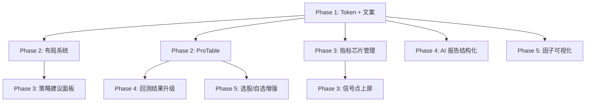

# 前端UI优化升级详细方案

## 1. 方案概述

### 1.1 背景

基于前期的系统评估（见 `146-前端UI设计现状评估报告.md`），当前 A 股分析系统前端 UI 处于**功能原型阶段**：10 个页面均有框架模板、路由已串联、服务层已就绪，但存在组件深度不足、交互精细度不够、设计系统不统一等核心短板。

本方案基于对以下高星开源项目的深度研究，提出系统化的 UI 优化升级方案：

| 参考项目 | ⭐ | 核心借鉴价值 |
|----------|-----|------------|
| Vue Vben Admin | 32k | 布局系统、多标签页、组件封装层次、主题配置 |
| Ant Design Pro | 38k | ProTable/ProForm 高级组件模式、Dashboard 模板 |
| KLineChart Pro | 304 | 多图联动、指标面板、十字光标、金融图表布局 |
| VueUse | 21k | Composition API 工具集（debounce/resize/storage） |
| TanStack Table | 28k | Headless 表格（虚拟滚动、排序筛选、列配置） |
| Storybook | 90k | 组件开发工作台、文档化、可视化测试 |
| AntV S2 | 1.7k | 表格可视化分析（因子透视表、IC/IR 分析） |

### 1.2 方案定位

本方案并非从零重构，而是在现有 Vue 3 + Ant Design Vue + KLineCharts 技术栈基础上，**借鉴顶级开源项目的最佳实践进行定向增强**。核心原则：

- **可增量落地**：每个优化项可独立实施，不阻塞其他任务
- **低侵入性**：不改变现有路由结构、状态管理、API 接口
- **渐进提升**：从当前状态稳步向专业投研终端靠拢

### 1.3 目标原则

本方案视觉规范遵循 `148-设计规范体系与Token系统.md` 定义的完整设计 Token 体系。以下为核心设计原则：

```
8pt 网格系统 — 所有间距仅在 4/8/12/16/24/32/40/48px 固定倍数中选择
shadcn/ui 极简中性风格 — 留白充足、轻质感、1组品牌色+中性灰阶
统一圆角 10px — 卡片、面板、弹窗、输入框，全局一致
双层轻阴影 — 仅 default/hover 两层，禁止厚重大投影
标准化排版 — 仅使用 12/14/16/20/24/32px 字号，标题行高1.4，正文行高1.6
浅色/深色双主题 — 通过 CSS 变量切换，统一全局视觉
卡片密度控制 — 单张 Card 仅保留 1 核心主信息 + 2 辅助信息
页面结构规范 — 每个功能区块固定「大标题+辅助说明+核心操作按钮」
空状态规范 — 渐变占位块 + 清晰引导文案
交互动效克制 — 仅 Hover/Focus 状态轻微过渡，不浮夸
```

**业务语义优先裁决**：以下三项因 A 股系统业务需求，不受"单品牌色/低信息密度"限制：
- 涨跌色保留红绿（红涨 `#DC2626` / 绿跌 `#16A34A`）
- 信号标签保留五色语义（看多/风险/关注/中性/失效）
- K线图表色保留 KLineChart 自有配色体系

**配色分层结构**：
```
Layer 1: 结构色（遵循单色+中性灰阶规范）— 背景/卡片/边框/文字
Layer 2: 语义功能色（业务语义优先）— 涨跌色/信号标签色
Layer 3: 图表色（KLineCharts 自有配色）— K线/指标线颜色
```

---

## 2. 借鉴项目深度分析与适配方案

### 2.1 Vue Vben Admin（32k⭐）— 布局系统升级

#### 2.1.1 核心学习点

Vben Admin v5 采用 pnpm monorepo 架构，核心包包括：

| 包名 | 功能 | 可借鉴程度 |
|------|------|-----------|
| `@vben/layout` | 布局系统（侧栏/顶栏/多标签页） | ⭐⭐⭐⭐⭐ |
| `@vben/stores` | 全局状态（主题/布局/应用） | ⭐⭐⭐⭐ |
| `@vben/preferences` | 用户偏好管理（布局/主题持久化） | ⭐⭐⭐⭐ |
| `@vben/theme` | 主题系统（CSS 变量 + 多主题切换） | ⭐⭐⭐⭐ |
| `@vben/utils` | 通用工具函数 | ⭐⭐⭐ |
| `@vben/hooks` | Composition API hooks | ⭐⭐⭐⭐ |

#### 2.1.2 借鉴方案：布局系统升级

**当前问题**：App.vue 中 sidebar 固定 200px 宽，深色硬编码在 theme-dark class，无多标签页、无用户偏好持久化。

**优化实施**：

1. **多标签页页面管理**（最高价值借鉴）
   - 在 router-view 上层封装标签页组件，记录已打开的路由
   - 支持标签页关闭、刷新、右键菜单
   - 标签页状态与 Pinia store 绑定，页面切换保持滚动位置和筛选状态
   - 实现方式：参考 VbenAdmin 的 `useTabs` + `Tabbar` 组件，用 `<keep-alive>` + `include` 实现缓存

2. **用户偏好持久化**
   - 将 `sidebarCollapsed` 从内存 store 迁移到 `localStorage`
   - 扩展到保存：默认股票、上次活跃页面、表格列配置
   - 借鉴 VbenAdmin `@vben/preferences` 的模式：一个 `preferences` store 管理所有用户设置，读写统一经由 `updatePreference(key, value)` action

3. **布局模式扩展**
   - 当前：固定左侧导航（200px）
   - 可扩展：顶部导航模式、混合模式（侧栏 + 顶部面包屑）
   - 不做强制切换，而是提供 layout store 配置，各页面按需适配

4. **主题变量的系统化管理**
   - 当前：CSS 变量散落在 `global.less` + 各页面 scoped style
   - 目标：统一的 `styles/tokens.less`（设计 Token 文件），所有组件引用 Token
   - 借鉴 VbenAdmin：在 `:root` 定义设计 Token，通过 JS 动态切换

#### 2.1.3 关键代码模式

```javascript
// stores/preferences.js — 借鉴 VbenAdmin preference 模式
export const usePreferencesStore = defineStore('preferences', () => {
  const state = reactive({
    sidebarCollapsed: localStorage.getItem('sidebarCollapsed') === 'true',
    defaultStock: localStorage.getItem('defaultStock') || '000001.SZ',
    lastActiveRoute: localStorage.getItem('lastActiveRoute') || '/dashboard',
    columnConfigs: JSON.parse(localStorage.getItem('columnConfigs') || '{}')
  })
  
  function updatePreference(key, value) {
    state[key] = value
    localStorage.setItem(key, String(value))
  }
  
  return { state, updatePreference }
})
```

```javascript
// components/Layout/TabBar.vue — 多标签页组件
// 注册路由 afterEach 钩子，自动添加标签
// 支持：关闭、关闭其他、关闭全部、刷新
// 使用 <keep-alive :include="cachedRoutes"> 缓存页面状态
```

### 2.2 Ant Design Pro（38k⭐）— 高级组件模式

#### 2.2.1 核心学习点

| 模式 | 功能 | 本项目落地场景 |
|------|------|--------------|
| ProTable | 高级表格（查询表单 + 工具栏 + 表格一体） | 选股结果、自选监控、回测列表、因子列表 |
| ProForm | 高级表单（分组/依赖/步骤表单） | 策略配置、回测参数、因子组合创建 |
| ProCard | 卡片容器（分组/可折叠/栅格） | 仪表盘面板、策略卡片 |
| StatisticCard | 指标卡（数值 + 趋势 + 对比） | 账户概览、回测指标摘要 |
| PageContainer | 页面容器（面包屑 + 标题 + 内容） | 所有页面的统一外壳 |

#### 2.2.2 借鉴方案：ProTable 模式引入

**当前问题**：每个页面的表格自行管理搜索、排序、分页逻辑，代码重复度高。

**优化实施**：

为项目创建一个轻量的 `ProTable` 封装组件，不是引入 Ant Design Pro（它是 React 生态），而是**借鉴其 API 设计模式**，用 Ant Design Vue 原生组件实现类似效果：

```vue
<!-- components/Common/ProTable.vue — 借鉴 ProTable API 设计 -->
<template>
  <div class="pro-table">
    <!-- 查询表单区 -->
    <div v-if="$slots.searchForm || searchFields.length" class="search-form">
      <slot name="searchForm" />
      <a-space>
        <a-button type="primary" @click="handleSearch">查询</a-button>
        <a-button @click="handleReset">重置</a-button>
      </a-space>
    </div>
    <!-- 工具栏 -->
    <div class="toolbar">
      <div class="toolbar-left"><slot name="toolbarLeft" /></div>
      <div class="toolbar-right"><slot name="toolbarRight" /></div>
    </div>
    <!-- 表格 -->
    <a-table v-bind="$attrs" :data-source="dataSource" :loading="loading" />
    <!-- 分页 -->
    <div class="pagination-bar" v-if="showPagination">
      <a-pagination v-model:current="current" :total="total" />
    </div>
  </div>
</template>
```

**具体落地页面的表格改造清单**：

| 页面 | 当前实现 | ProTable 改造后 |
|------|---------|---------------|
| 自选监控 | 独立 a-table + 手动列配置 | ProTable + 内置查询/搜索/列配置 |
| 选股结果 | ScreeningResults 组件 | ProTable + 筛选条件面板 + 分页 |
| 因子列表 | 卡片网格 | ProTable + 分类/搜索 + IC 排序 |
| 策略模板 | 卡片网格 + 搜索 | ProTable + 分类筛选 + 模板预览 |
| 报告中心 | 卡片网格 | ProTable + 类型筛选 + 日期过滤 |

#### 2.2.3 StatisticCard 模式

借鉴 Ant Design Pro 的 StatisticCard，封装一个 `StatsCard` 组件用于仪表盘和账户页面：

```vue
<!-- 已存在于 dashboard 中的统计卡片 → 提取为全局组件 -->
<StatsCard
  title="自选股总数"
  :value="stats.totalStocks"
  :trend="stats.upStocks > stats.downStocks ? 'up' : 'down'"
  :footer="`上涨 ${stats.upStocks} 只`"
  icon="📈"
/>
```

### 2.3 KLineChart Pro（304⭐）— 金融图表优化

#### 2.3.1 核心学习点

KLineChart Pro 基于 SolidJS 构建，但其**布局概念和交互模式**与框架无关：

| 特性 | 说明 | 借鉴方案 |
|------|------|---------|
| 多窗格布局 | 主图 + 多个副图（VOL/MACD/RSI/KDJ） | 已部分实现，需增强窗格联动 |
| 指示器快速切换 | 指标列表 + 参数配置 | 需增加芯片式管理 |
| 十字光标联动 | 鼠标悬停跨窗格同步 | 当前缺失 |
| 周期切换 | 日/周/月/分钟线 | 已实现基本切换 |
| 时间范围选择器 | 拖拽选择、缩放 | 需增强 |
| 覆盖层标注 | 信号点/趋势线/风险线 | 当前缺失 |

#### 2.3.2 借鉴方案：指标 IDE 图表升级

优化点按影响面排序：

**1. 多窗格十字光标联动**
- 当前：KLineCharts 返回的数据已支持 crosshair，但配置未开启
- 实现：在 `KLineChart/index.vue` 的 `initChart` 方法中添加 crosshair 配置

```javascript
// KLineChart 已有 API：chart.setStyleOptions({ crosshair: {...} })
// 需补充：crosshair 水平/垂直线样式 + 窗格间联动
chart.setStyleOptions({
  crosshair: {
    horizontal: {
      text: { color: '#D1D4DC', borderSize: 1, borderColor: '#2A2A2A' }
    },
    vertical: {
      text: { color: '#D1D4DC', borderSize: 1, borderColor: '#2A2A2A' }
    }
  }
})
```

**2. 信号点标注与覆盖层**
- 当前：KLineCharts 支持 `override` 和 `shape` API
- 实现：在 K 线上叠加信号点（买入/卖出/风险线），鼠标悬停显示信号说明
- 借鉴 KLineChart Pro 的覆盖层设计：信号点使用小圆形标记 + tooltip 弹出
- 数据格式：
```javascript
const signalShapes = [
  { type: 'circle', 点位: x, 价格: y, 颜色: '#ef4444', tooltip: 'MACD金叉+放量突破' },
  { type: 'line', 起点: p1, 终点: p2, 颜色: '#f59e0b', label: '风险线 1680' }
]
```

**3. 指标芯片式管理**
- 当前：通过下拉菜单添加/移除指标
- 目标：参考 KLineChart Pro 的指标列表，改为"芯片"（Tag/ Badge）模式
  - 每个活跃指标显示为独立芯片（名称 + 参数 + 颜色标识）
  - 芯片可拖拽排序（调整图表上下位置）
  - 点击芯片弹出参数编辑面板
  - 芯片右侧"×"快速移除

**4. ChartService 接口增强**
- 当前 `chartService.getKlineData()` 返回原始 OHLCV
- 需扩展为返回含信号标记的数据结构，接口对齐前端展示需求

### 2.4 VueUse（21k⭐）— 工具集引入

#### 2.4.1 直接可引入的工具

VueUse 可与现有 Vue 3 项目无缝集成。以下是直接可以引入且立即产生价值的工具：

| VueUse 工具 | 解决的问题 | 替换的手写代码量 |
|------------|-----------|----------------|
| `useDebounceFn` | 股票搜索防抖 | ~15 行手写 |
| `useThrottleFn` | 图表 resize 节流 | ~10 行手写 |
| `useResizeObserver` | 图表自适应 | ~20 行手写（已有一个） |
| `useLocalStorage` | 用户偏好持久化 | ~30 行手写 |
| `useInterval` | 定时刷新数据 | ~15 行手写 |
| `useEventListener` | 事件监听 | ~10 行手写 |
| `useFullscreen` | 全屏查看图表 | ~20 行手写 |
| `useMediaQuery` | 响应式断点检测 | ~10 行手写 |
| `useWindowSize` | 窗口尺寸变化响应 | ~8 行手写 |
| `useDateFormat` | 日期格式化（替代 moment） | 大量 moment 调用 |

#### 2.4.2 迁移示例

当前代码（dashboard/index.vue）：
```javascript
// 手写防抖 - 需要自己维护 timer
async handleStockSearch(value) {
  if (this.searchTimer) clearTimeout(this.searchTimer)
  this.searchTimer = setTimeout(() => {
    this.searchStocks(value)
  }, 300)
}
```

迁移后：
```javascript
import { useDebounceFn } from '@vueuse/core'
// 一行替代
const debouncedSearch = useDebounceFn((value) => searchStocks(value), 300)
```

#### 2.4.3 安装方式

```bash
npm install @vueuse/core
# 可选 - 仅引入按需使用，不影响构建大小
```

### 2.5 TanStack Table（28k⭐）— 表格系统增强

#### 2.5.1 核心价值

TanStack Table Vue 版提供 Headless 表格能力——不捆绑 UI，只提供状态逻辑。对当前项目的价值点：

| 能力 | 当前状态（Ant Design Table） | TanStack Table 增强 |
|------|---------------------------|-------------------|
| 虚拟滚动（大数据量） | 不支持 | ✅ 支持万行数据流畅渲染 |
| 列配置持久化 | 自选监控有实现 | ✅ 统一方案 |
| 排序筛选组合 | 仅基础 | ✅ 多列排序 + 自定义筛选 |
| 行展开 | ✅ 支持 | ✅ 更灵活 |
| 树形数据 | 不支持 | ✅ 支持 |
| 跨页选中 | 需手动实现 | ✅ 内置 |
| 列冻结 | 需手动配置 | ✅ 声明式 |
| 表头分组 | 部分支持 | ✅ 完整支持 |

**策略建议**：
- 不替换所有 Ant Design Table，那会对项目造成过大侵入
- 只在**大数据量场景**（自选监控上千条、回测交易记录）引入 TanStack Table
- 普通场景继续使用 Ant Design Table，通过 ProTable 封装统一 API

### 2.6 Storybook（90k⭐）— 组件开发工作台

#### 2.6.1 引入价值

项目当前有 15+ 组件分散在 `components/` 目录下，但存在以下问题：
- 没有组件目录索引
- 组件使用方式靠读源码
- 组件状态（loading/empty/error/数据）测试靠手动

Storybook 提供：
- 组件可视化浏览目录
- 交互式参数调节（Controls）
- 组件状态文档化（Docs/auto-generated）
- 视觉回归测试（Chromatic）

#### 2.6.2 实施建议

**轻量起步**（不增加过多维护负担）：
1. 只为核心业务组件添加 Story（直接受益面大的）
   - `KLineChart` - 展示各参数组合效果
   - `StrategySignalPanel` - 展示看多/风险/观察各状态
   - `StatsCard` - 展示各数值类型
   - `ProTable` - 展示列配置、筛选组合
2. 不需为每个基础组件（如 sidebar）写 Story
3. Story 随组件开发走，不单独投入时间补旧组件

**替代方案**：如果 Storybook 部署和 CI 集成成本过高，可用 Vite 自带的 `vite-plugin-vue-inspector` + 组件目录文档替代，但 Storybook 的交互式调试能力无法完全替代。

### 2.7 AntV S2（1.7k⭐）— 表格可视化

#### 2.7.1 适用场景

S2 适合**透视表/交叉表**场景，对因子研究页面升级有直接价值：

| 场景 | S2 能力 | 当前实现 |
|------|---------|---------|
| 因子 IC 分析表 | 行列交叉表 + 热力图 | 不存在 |
| 回测结果分组统计 | 透视表 + 条件格式 | 不存在 |
| 行业/板块收益矩阵 | 多维分析表 | 不存在 |

S2 与 Ant Design Vue 可共存（均为 AntV 生态），无冲突风险。

**策略建议**：仅在因子研究和回测结果页面引入 S2，不全局使用。

---

## 3. 阶段实施计划

### 阶段一（P0-P1）：基础规范统一 + 工具引入（2周）

#### 3.1.1 实施项

**A. 设计 Token 提取（3天）**

按照 `148-设计规范体系与Token系统.md` 第 2 节定义的完整 Token 表，创建 `src/styles/tokens.less`。

**空间 Token（8pt 网格）**：`--space-{4,8,12,16,24,32,40,48}`，无其他非标间距
- 卡片内边距统一 `--space-24` (24px)
- 卡片间距统一 `--space-16` (16px)
- 页面左右边距统一 `--space-24` (24px)
- 页面内容最大宽度 `1200px`
- 按钮高度 `40px` / 输入框高度 `40px` / 图标 `16px` / `20px`

**品牌色**：仅一组 `--color-brand-{50,100,200,500,600,700}`，品牌主色 `#3B82F6`

**中性灰阶（浅色主题）**：
- 页面背景 `#FAFAFA` / 卡片 `#FFFFFF` / 次级 `#F5F5F5`
- 边框 `#E5E5E5` / 强边框 `#D4D4D4`
- 主文字 `#171717` / 二级 `#525252` / 辅助 `#A3A3A3`

**中性灰阶（深色主题）**：
- 页面背景 `#0A0A0A` / 卡片 `#1A1A1A` / 次级 `#262626`
- 边框 `#333333` / 强边框 `#525252`
- 主文字 `#FAFAFA` / 二级 `#A3A3A3` / 辅助 `#666666`

**语义功能色**（业务语义优先，不受单色限制）：
- 上涨 `#DC2626`（浅色）`#EF4444`（深色）
- 下跌 `#16A34A`（浅色）`#22C55E`（深色）
- 信号五色：看多（红）、风险（绿）、关注（黄）、中性（灰）、失效（暗红）

**圆角 Token**：`--radius-sm: 6px` / `--radius-md: 10px`（统一卡片标准） / `--radius-lg: 12px` / `--radius-full: 9999px`

**阴影 Token**（仅两层轻阴影）：
- `--shadow-default: 0 1px 2px 0 rgb(0 0 0 / 0.05)`（浅色）/ `0 1px 2px 0 rgb(0 0 0 / 0.3)`（深色）
- `--shadow-hover: 0 4px 6px -1px rgb(0 0 0 / 0.08)`（浅色）/ `0 4px 6px -1px rgb(0 0 0 / 0.4)`（深色）

**排版 Token**：仅使用 `12/14/16/20/24/32px`，禁止非标字号
- 标题行高 `1.4`，正文行高 `1.6`
- 正文 `400` / 小标题/按钮 `500` / 大标题/数值 `600`

**主题切换机制**：在 `:root` 定义浅色值，`.dark` 定义深色值覆盖，通过 JS 切换 `class="dark"`

完整 Token 参数表详见 `148-设计规范体系与Token系统.md` 第 2 节。设计系统可运行的 React+Tailwind 参考实现见 `frontend/design-system/`。

`src/styles/tokens.less` 引用 `global.less` 中的变量定义替换为 Token 引用，各页面逐步迁移。
**B. 文案边界统一 + 免责声明（2天）**
- 全局搜索替换：买入→关注信号、卖出→风险退出信号、交易记录→回测事件、持仓→模拟组合
- 创建 `DisclaimerFooter.vue` 组件，在策略输出页面底部固定展示
- 文字："本系统输出为策略研究与决策支持信息，不连接券商交易接口，不自动下单，不执行真实资金调仓。所有结论仅供研究参考。"

**C. 信号标签体系组件化（2天）**
- 创建 `SignalTag.vue` 组件，统一管理五色信号语义（低饱和度调色方案见完整 Token 表）
- 替换各页面散落的 `<a-tag>` 调用
- SignalTag 支持：大小（small/default）、可点击、tooltip 扩展说明
- 信号标签色值使用 `--signal-{bullish,bearish,watch,neutral,invalid}` 变量，双主题自动适配
**D. 引入 VueUse（1天）**
- `npm install @vueuse/core`
- 首批引入工具：`useDebounceFn`、`useResizeObserver`、`useLocalStorage`、`useInterval`
- 替换对应场景的手写工具代码

**E. 用户偏好持久化（2天）**
- 创建 `stores/preferences.js` store
- `sidebarCollapsed` 迁移到 localStorage
- 增加：默认股票保存、表格列配置保存、上次活跃路由保存


**F. 视觉规范统一（纳入本期）**
- 全局圆角统一：所有卡片/面板/弹窗/输入框使用 `--radius-md: 10px`
- 全局阴影统一：仅保留 `--shadow-default`（常态）和 `--shadow-hover`（悬停）两层轻阴影
- 字号标准化：仅使用 `12/14/16/20/24/32px`，全局搜索替换非标字号
- 行高标准化：大标题 `1.4`，正文 `1.6`，全局应用
- 浅色主题适配：所有页面在非 `.dark` 状态下加载浅色 Token 值
- 页面结构规范化：每个功能区块设置为「区块标题 + 辅助说明文案 + 核心操作按钮」三段式
- 空状态规范化：引入 `EmptyState.vue`（渐变占位块 `linear-gradient` + 居中图标 + 标题 + 说明 + 操作按钮）
- 交互动效规范化：所有 hover/focus 过渡使用 `0.15s ease`，按钮 active 使用 `scale(0.98)` 0.1s
- 组件层级规范：按 4 层架构组织（Token → Atoms → Molecules → Organisms → Pages）

详见 `148-设计规范体系与Token系统.md` 第 3-4 节。可运行的参考实现见 `frontend/design-system/`。
#### 3.1.2 涉及文件

| 文件 | 改动 |
|------|------|
| `src/global.less` | 精简为 Token 引用 |
| `src/styles/tokens.less` | 新建，统一 Token 定义 |
| `src/components/Common/SignalTag.vue` | 新建 |
| `src/components/Common/DisclaimerFooter.vue` | 新建 |
| `src/components/Common/EmptyState.vue` | 新建，渐变占位块+引导文案 |
| `src/styles/tokens.less` | 新增8pt网格/双主题/圆角10px/阴影/字号Token |
| `src/stores/preferences.js` | 新建 |
| `src/App.vue` | 引用 Token 文件 |
| 各 view 页面 | 文案替换 + SignalTag 替换 |
| `package.json` | 新增 `@vueuse/core` |

### 阶段二（P0-P1）：布局系统升级 + 核心组件（2-3周）

#### 3.2.1 实施项

**A. 多标签页页面管理（4天）**
- 创建 `Layout/TabBar.vue` 组件
- 在 `App.vue` 的 `<router-view>` 外层添加 TabBar
- 路由守卫自动管理标签页状态
- 支持：关闭、关闭其他、关闭全部、右键菜单、鼠标中键关闭
- 使用 `<keep-alive :include="cachedRoutes">` 缓存页面状态

**B. ProTable 组件封装（3天）**
- 创建 `components/Common/ProTable.vue`
- 内置：查询表单区、工具栏（左/右）、表格体、分页栏
- 默认 slot 方案：searchForm / toolbarLeft / toolbarRight / 表格 body
- 该组件作为纯 UI 封装，不耦合后端 API 格式

**C. StatsCard 组件提取（1天）**
- 将 dashboard 中的统计卡片提取为 `components/Common/StatsCard.vue`
- 支持：标题、数值、趋势（up/down/neutral）、副标题、图标、颜色配置
- **密度控制**：严格遵守「1 核心主信息（数值）+ 2 辅助信息（标题+副标题）」结构
- 同步替换 account 页面的概览卡片

**D. KLineChart 十字光标 + 多窗格增强（3天）**
- 开启 crosshair 配置（水平/垂直联动）
- 确保 VOL/MACD/RSI 副图窗格与主图窗格光标同步
- 增强 tooltip：悬停显示 OHLCV + 涨跌幅 + 成交额 + 换手率

**E. Preference store 与 TabBar 联动（1天）**
- TabBar 状态写入 preferences store
- 下次打开页面恢复上次活跃标签页

#### 3.2.2 涉及文件

| 文件 | 改动 |
|------|------|
| `src/App.vue` | 添加 TabBar 组件 + keep-alive |
| `src/components/Layout/TabBar.vue` | 新建 |
| `src/components/Common/ProTable.vue` | 新建 |
| `src/components/Common/StatsCard.vue` | 新建 |
| `src/components/KLineChart/index.vue` | 增强 crosshair + tooltip |
| `src/stores/preferences.js` | 新增 tabBar 相关状态 |

### 阶段三（P1）：指标 IDE 深度优化（2-3周）

#### 3.3.1 实施项

**A. 指标实例芯片管理（3天）**
- 参考 KLineChart Pro 的指标列表模式
- 将当前指标管理改为"芯片"模式
- 每个芯片：名称、参数、颜色标识、删除按钮
- 点击芯片弹出参数编辑面板（Poper 或 Drawer）
- 支持芯片拖拽排序（改变副图顺序）

**B. 信号点上屏（2天）**
- KLineCharts API `chart.createShape()` 实现信号点标注
- 信号点类型：买入点（红色圆点）、卖出点（绿色圆点）、风险线（黄色虚线）
- 信号点 hover 展示触发原因 tooltip
- 信号点数据来源：当前 `GET /api/v2/strategy/outputs` 接口

**C. 策略建议面板（3天）**
- 新建 `components/Strategy/StrategySuggestionPanel.vue`
- 布局（右侧固定宽 320px 抽屉或固定侧栏）：
  - 当前信号状态（看多/风险/观察/中性）
  - 置信度（进度条 0-100%）
  - 评分（0-100 数值）
  - 触发原因（关联指标值列表）
  - 风险线/目标区间（价格标注）
  - 建议仓位（百分比范围）
- **密度控制**：信号面板信息量放宽至「1 核心（信号状态+评分）+ 3 辅助（置信度+触发原因+风险线/目标区间）」，因策略输出业务语义需要高于通用密度限制
  - 失效条件
  - 操作按钮："一键回测验证"、"生成报告"
- 该面板从 `/api/v1/strategy/:ts_code/current` 获取数据

**D. 代码质量检查面板（2天）**
- 在指标 IDE 左侧研究栏增加 Tab
- 检测项：
  - 未来函数检测（使用未来数据）
  - 缺失输出字段（score / signal / risk_line / target_zone）
  - 空值/NaN 处理
  - 变量作用域泄露
- 纯前端静态检查，调用 `/api/v1/indicator/check` 或本地 AST 分析

**E. 一键联动入口（1天）**
- 策略建议面板底部："一键回测验证"→ 跳转 backtest 并预填策略参数
- "生成报告" → 跳转 reports-center 并创建报告草稿
- 通过 router query 传递上下文（`/backtest?strategy=xxx&params=yyy`）

#### 3.3.2 涉及文件

| 文件 | 改动 |
|------|------|
| `src/views/indicator-ide/index.vue` | 布局重构（左研/中国/右议） |
| `src/components/IndicatorChipManager.vue` | 新建 |
| `src/components/Strategy/StrategySuggestionPanel.vue` | 新建 |
| `src/components/KLineChart/index.vue` | 新增信号点标注方法 |
| `src/services/strategyService.js` | 新增建议面板 API 调用 |

### 阶段四（P1-P2）：回测结果升级 + AI 报告结构化（2-3周）

#### 4.1 回测结果升级

**当前问题**：回测页面仅展示基础配置和结果，缺少多维可视化。

**详细实施**：

**A. 回测结果摘要卡片组（2天）**
- 借鉴 Ant Design Pro StatisticCard 模式，封装 `BacktestStatsCards`
- 显示：总收益、年化收益、最大回撤、夏普比、胜率、盈亏比、交易次数
- 每项数值带颜色区划（正收益红/绿，回撤警告色）

**B. 三条核心曲线（3天）**
- 权益曲线 vs 基准曲线（ECharts 折线图，两条线叠加）
- 回撤曲线（ECharts 面积图，负值区着色）
- 月度收益热力图（ECharts heatmap calendar 或 AntV S2 透视表）
  - 横轴月份、纵轴年份、颜色表示收益率

**C. 回测假设展示（1天）**
- 在配置区右侧增加"回测假设"折叠面板
- 展示：手续费率、印花税率、滑点、T+1 规则、涨跌停处理、停牌处理、复权方式、样本内/外切分
- 这些参数从回测配置中读取并显式展示

**D. 策略失效条件（1天）**
- 在结果区底部加入"策略失效条件"区块
- 展示：在什么市场环境下策略表现极差、连续亏损警戒线、最大回撤接近等

**E. 一键生成报告（1天）**
- 在回测结果区加入"生成回测报告"按钮
- 跳转到 reports-center 并预填回测 ID 和参数

#### 4.2 AI 报告结构化

**当前问题**：AI 分析页面为聊天日志风格，缺少结构化报告支撑。

**优化实施**：

**A. 页面布局升级（2天）**
- 从日志风格改为"左目录 + 中正文 + 右结论"三栏布局
- 左侧：报告目录（摘要/技术面/基本面/资金面/策略验证/风险提示/最终建议）
- 中间：报告正文（结构化 Markdown 渲染，支持图表嵌入）
- 右侧：结论卡（策略评分、信号状态、置信度、风险等级、关注区间、风险线）

**B. AI 结论结构化（2天）**
- 后端返回 AI 分析结果时，每条结论包含 5 个字段：
  - 结论正文
  - 数据依据（引用指标值/图表）
  - 置信度（0-100%）
  - 风险说明
  - 是否需要人工复核

**C. 多角色分析卡片（2天）**
- 同一个股票可以切换不同分析视角
- 角色：技术分析、基本面分析、资金面分析、综合策略
- 每个角色独立卡片，可折叠展开

**D. 报告导出（2天）**
- 导出格式：Markdown / HTML / PDF / JSON
- 导出内容包含免责声明
- 导出入口：报告右上角"导出"按钮 + 下拉选择格式

### 阶段五（P2-P3）：选股/自选/因子增强（2-3周）

#### 5.1 实施项

**A. 自选监控信号变化追踪（3天）**
- 新增列："信号变化"（新出现/增强/减弱/失效）
- 新增列："策略评分" 0-100 数值
- 新增列："触发原因" 简略文本
- 新增列："风险线/目标区间" 价格标注
- 新增筛选器：新信号、风险信号、高评分、行业分类

**B. 因子研究可视化（3天）**
- 引入 AntV S2 创建因子 IC/IR 透视表 + 热力图
- 因子分组收益柱状图（ECharts）
- 因子相关性矩阵（ECharts heatmap）
- 因子覆盖度统计（环形图）

**C. 选股结果深度优化（2天）**
- 选股结果使用 ProTable 模式
- 支持结果排序（评分/涨跌幅/换手率等）
- 支持一键加入自选监控
- 支持结果导出为 CSV/JSON

#### 5.2 涉及文件

| 文件 | 改动 |
|------|------|
| `src/views/watchlist/index.vue` | 新增列 + 筛选器 |
| `src/views/factor-manager/index.vue` | 新增可视化 Tab |
| `src/components/StockScreener/ScreeningResults.vue` | ProTable 改造 |

---

## 4. 实施路线图

### 4.1 排期总览

```
Week 1-2  ─── Phase 1: 基础规范 + 工具引入
  ├── Design Token 文件建立
  ├── 文案统一 + 免责声明组件
  ├── SignalTag 信号标签组件
  ├── VueUse + Preference store
  └── 代码审查与修复

Week 3-5  ─── Phase 2: 布局系统 + 核心组件
  ├── TabBar 多标签页管理
  ├── ProTable 通用表格组件
  ├── StatsCard 通用卡片组件
  ├── KLineChart 光标/多窗格增强
  └── 用户偏好持久化联动

Week 6-8  ─── Phase 3: 指标 IDE 深度优化
  ├── 指标芯片管理
  ├── 信号点上屏
  ├── 策略建议面板
  ├── 代码质量检查
  └── 一键联动入口

Week 9-11 ─── Phase 4: 回测 + AI 报告
  ├── 回测结果多维展示
  ├── 回测假设展示
  ├── AI 报告结构化
  ├── 多角色分析卡片
  └── 报告导出

Week 12-13 ─── Phase 5: 选股/自选/因子增强
  ├── 自选信号变化追踪
  ├── 因子可视化（S2）
  ├── 选股结果 ProTable 升级
  └── 整体联调与修复
```

### 4.2 工作项依赖关系



### 4.3 风险与缓解措施

| 风险 | 概率 | 影响 | 缓解措施 |
|------|------|------|---------|
| Phase 2 多标签页引入后页面状态丢失 | 中 | 高 | keep-alive include 白名单 + 状态持久化到 store |
| KLineChart crosshair 与已有配置冲突 | 低 | 中 | 在独立分支验证后合并，准备回滚方案 |
| AI 报告结构化需要后端配合 | 高 | 高 | 前端先做布局骨架和后端分离，后端逐步对齐输出格式 |
| TanStack Table 与 Ant Design Table 并存增加维护负担 | 中 | 中 | 仅限大数据量场景使用，普通表保持在 Ant Design 生态 |
| 回测结果页升级需要较多的后端数据 | 高 | 高 | 前端先用模拟数据验证展示，后接真实接口 |

---

## 5. 指标体系与验收标准

### 5.1 可量化的目标

| 指标 | 当前值 | 目标值 | 测量方式 |
|------|-------|-------|---------|
| CSS 变量 Token 覆盖率 | 散落无统一 | 100% 引用 Token | 检查 tokens.less + 页面引用 |
| 页面使用统一组件比例 | ~40% | >80% | 组件引用计数 |
| 策略建议参数完整度 | 仅评分 | 7 项（评分/信号/置信度/触发原因/风险线/目标区间/建议仓位） | 功能验收 checklist |
| 回测结果可视化维度 | 1（基础结果） | 5（摘要卡+权益曲线+回撤+月度热力图+失效条件） | 功能验收 checklist |
| AI 报告结构完整度 | 日志风格 | 7 章节结构化报告 + 导出功能 | 功能验收 checklist |
| 多标签页支持 | 无 | 支持 | 操作验收 |
| 页面切换保持上下文 | 无 | 保持股票/筛选状态 | 操作验收 |
| 3 次点击内从自选→IDE | 部分 | 全部支持 | 操作验收 (P0) |

### 5.2 体验验收检查单

- [ ] 用户能在 3 次点击内从自选股进入指标 IDE（自动加载选中股票）
- [ ] 用户能在指标 IDE 中看到信号原因、风险线、目标区间
- [ ] 用户能从任意策略建议一键进入回测验证（预填参数）
- [ ] 用户能从回测结果一键生成报告（预填回测 ID）
- [ ] 页面切换不丢失筛选条件和滚动位置（有标签页缓存的页面）
- [ ] 页面中不出现自动交易、自动下单、实盘托管类误导文案
- [ ] 所有策略输出页面固定展示免责声明
- [ ] 移动端或窄屏不出现文字严重重叠

### 5.3 技术验收检查单

- [ ] 前端构建通过（`pnpm build` 无报错）
- [ ] KLineChart 在 2000 根 K 线内交互流畅（60fps）
- [ ] ProTable 在 500 行数据内排序筛选无卡顿
- [ ] 标签页切换后 `keep-alive` 恢复页面状态
- [ ] 偏好设置刷新后保持
- [ ] 导出的报告内容包含免责声明
- [ ] 各页面接口异常时有清晰错误状态

---

## 6. 附录

### 6.1 新增依赖清单

| 依赖 | 版本建议 | 用途 | Phase |
|------|---------|------|-------|
| `@vueuse/core` | latest | 工具函数集（debounce/resize/storage） | 1 |
| `@ant-design/icons-vue` | 已安装 | 图标集扩展使用 | 全部 |
| `@antv/s2` | latest | 因子透视表 / 回测热力图 | 5 |
| `@klinecharts/pro` | 0.1.x 观察 | 金融图表参考，不作为直接依赖 | 3 |

### 6.2 新增组件清单

组件按 4 层架构组织（详见 `148-设计规范体系与Token系统.md` 第 3 节）：

**Layer 1 — 原子组件 (Atoms)**
| 组件 | 目录 | 用途 | Phase |
|------|------|------|-------|
| `Button` | `components/Common/` | 按钮 (primary/secondary/ghost/danger) | 1 |
| `Input` | `components/Common/` | 输入框 + SearchInput | 1 |
| `Badge` | `components/Common/` | 涨跌徽标 | 1 |
| `SignalTag.vue` | `components/Common/` | 信号标签（5色语义） | 1 |
| `Spinner` | `components/Common/` | 加载指示器 | 1 |
| `Divider` | `components/Common/` | 分割线 | 1 |

**Layer 2 — 分子组件 (Molecules)**
| 组件 | 目录 | 用途 | Phase |
|------|------|------|-------|
| `Card` | `components/Common/` | 卡片容器 (24px padding, 10px radius, 1px border) | 1 |
| `StatsCard.vue` | `components/Common/` | 统计指标卡（1主值+2辅值+趋势） | 2 |
| `EmptyState.vue` | `components/Common/` | 空状态（渐变占位块+引导文案） | 1 |
| `ProTable.vue` | `components/Common/` | 通用高级表格（查询栏+工具栏+表格+分页） | 2 |
| `DisclaimerFooter.vue` | `components/Common/` | 免责声明 | 1 |
| `TabBar.vue` | `components/Layout/` | 多标签页管理 | 2 |

**Layer 3 — 组织组件 (Organisms)**
| 组件 | 目录 | 用途 | Phase |
|------|------|------|-------|
| `IndicatorChipManager.vue` | `components/` | 指标芯片管理 | 3 |
| `StrategySuggestionPanel.vue` | `components/Strategy/` | 策略建议面板（1核心+3辅助） | 3 |
| `BacktestStatsCards.vue` | `components/Backtest/` | 回测指标摘要 | 4 |
| `EquityCurveChart.vue` | `components/Backtest/` | 权益曲线 | 4 |
| `DrawdownChart.vue` | `components/Backtest/` | 回撤曲线 | 4 |
| `MonthlyHeatmap.vue` | `components/Backtest/` | 月度收益热力图 | 4 |
| `ReportCatalog.vue` | `components/Report/` | 报告目录 | 4 |
### 6.3 新增 Store 清单

| Store | 文件 | 状态 | Phase |
|-------|------|------|-------|
| `usePreferencesStore` | `stores/preferences.js` | 用户偏好持久化 | 1 |
| `useTabStore` | `stores/tabs.js` | 多标签页状态 | 2 |
| `useReportStore` | `stores/report.js` | 报告生成状态 | 4 |

### 6.4 参考资料

1. Vue Vben Admin v5 — [GitHub](https://github.com/vbenjs/vue-vben-admin) / [文档](https://doc.vben.pro/)
2. Ant Design Pro — [GitHub](https://github.com/ant-design/ant-design-pro) — ProTable/ProForm 设计模式
3. KLineChart Pro — [GitHub](https://github.com/klinecharts/pro) — 金融图表布局
4. KLineChart — [GitHub](https://github.com/klinecharts/KLineChart) / [文档](https://klinecharts.com/) — 已在用的核心图表库
5. VueUse — [GitHub](https://github.com/antfu/vueuse) — Vue Composition 工具集
6. TanStack Table Vue — [GitHub](https://github.com/TanStack/table) — Headless 表格
7. Storybook for Vue — [文档](https://storybook.js.org/docs/vue/get-started) — 组件开发工作台
8. AntV S2 — [GitHub](https://github.com/antvis/S2) — 表格可视化分析库
9. 148-设计规范体系与Token系统.md — `002-方案存档/148-设计规范体系与Token系统.md` — 完整Token参数表+组件分层+交互规范
10. frontend/design-system/ — `frontend/design-system/` — React+Tailwind 可运行参考实现

### 6.5 术语说明

| 术语 | 说明 |
|------|------|
| Token | 设计系统中可复用的最小视觉属性（颜色、间距、圆角等） |
| 8pt 网格系统 | 以 8px 为基数的间距体系，仅使用 4/8/12/16/24/32/40/48px 固定倍数 |
| shadcn/ui | 极简中性 UI 风格，留白充足、轻质感、1组品牌色+中性灰阶 |
| ProTable | 借鉴 Ant Design Pro 的表格设计模式，集查询/工具栏/表格/分页于一体 |
| Headless | 只提供逻辑和状态，不提供 UI 渲染的组件模式 |
| Crosshair | K 线图表中的十字光标，跨窗格联动显示 |
| 芯片（Chip） | 指标管理中的标签式交互元素，可配置/拖拽/删除 |
| 信号点 | K 线图上叠加的买入/卖出/风险标记点 |
| 权益曲线 | 策略模拟交易的资金曲线 vs 基准指数曲线 |
| 回撤曲线 | 从策略净值峰值的回落幅度曲线 |
