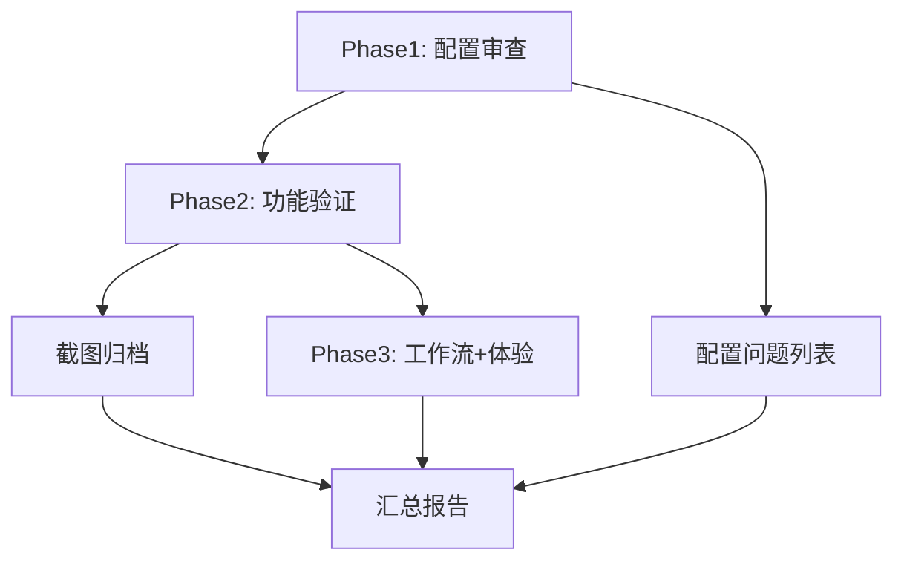

# 160 — 前端UI功能实现与配置全面检查计划

**前置报告索引：**

| 编号 | 内容 | 关系 |
|------|------|------|
| 146 | 前端UI设计现状评估报告 | 代码级评估，聚焦组件深度与设计差距 |
| 147 | 前端UI优化升级详细方案 | 5阶段优化计划，尚未实施 |
| 148 | 设计规范体系与Token系统 | Token定义与组件分层规范 |
| 156-158 | 项目上线检测报告/检查计划/检查报告 | 部署级检查，72项已执行 |
| 159 | AI代码审查报告 | 修复代码质量审查 |
| **本期(160)** | **前端UI功能实现与配置全面检查计划** | **本文件：功能+配置+UX逐项实物检验** |

---

## 一、检查背景与动机

### 1.1 为什么需要这次检查

前序工作（146-159）完成了以下内容：

- **146 报告**：从代码层面评估了 UI 完成度与设计差距（静态分析）
- **147 方案**：提出了 5 阶段优化计划（尚未实施）
- **156-158 报告**：验证了部署架构和 API 连通性（基础架构层）
- **159 审查**：验证了 P0/P1 bug 修复的代码质量

**但以上工作均未回答以下问题：**

> 站在用户视角，前端到底能不能用？每个按钮按下去有没有反应？配置是否正确？数据流是否跑通？

这次检查的核心目标，是从"代码通过"跃迁到"功能可用"——**以实际操作为主、代码验证为辅**，逐页检验前端 UI 的功能实现完整性和配置正确性。

### 1.2 与已有检查的区分

| 检查维度 | 156-158 (已做) | **本期 160 (要做)** | 关系 |
|----------|---------------|-------------------|------|
| 部署架构 | ✅ Docker/Nginx/API 连通 | ❌ 不重复 | 取结果，不重查 |
| 代码规范 | ✅ ESLint/构建/分包 | ✅ 补充：运行时错误 | 互补 |
| **UI 功能完整性** | ❌ 仅确认渲染不白屏 | ✅ **逐页逐组件交互验证** | 新增 |
| **配置正确性** | ❌ 未覆盖 | ✅ **全配置链审查** | 新增 |
| **UX 感知体验** | ❌ 未覆盖 | ✅ **实际操作流 + 状态感知** | 新增 |
| **跨页面工作流** | ❌ 未覆盖 | ✅ **工作流连贯性验证** | 新增 |

---

## 二、检查范围

### 2.1 按层次划分

```
Layer 1 配置层 (Config)
  ├── Vite 构建配置         vite.config.js
  ├── 路由配置               router/index.js
  ├── Pinia Stores          stores/{app,theme,shortcuts}.js
  ├── 全局样式/Token         global.less
  ├── Axios 服务层           utils/request.js
  ├── i18n 配置              locales/index.js
  ├── Docker/Nginx 前端部署  Dockerfile, docker-compose.yml, nginx.conf
  └── 环境变量注入           .env, index.html, docker-entrypoint.sh

Layer 2 页面层 (Pages — 11 路由)
  ├── 登录                   /login
  ├── 仪表盘                 / 或 /dashboard
  ├── 个股策略分析            /indicator-ide
  ├── 选股系统               /screener
  ├── 自选监控               /watchlist
  ├── AI 分析                /ai-analysis
  ├── 回测系统               /backtest
  ├── 因子组合管理            /factor-manager
  ├── 策略模板               /strategy-templates
  ├── 报告中心               /reports-center
  └── 账户管理               /account

Layer 3 组件层 (Components — 15+)
  ├── 全局组件: Sidebar, ErrorBoundary, DataSourceStatusBar, ShortcutsHelp
  ├── 业务组件: KLineChart, CodeEditor, StrategySignalPanel, ReportViewer
  ├── 选股子组件: PipelineFlow, ScreeningResults, SignalFusionConfig, SignalDetailModal
  └── 工具组件: FactorSelector, ReviewReport, AiSignalBus, ResonancePanel

Layer 4 工作流层 (Workflows — 跨页面)
  ├── 自选 → IDE 上下文传递
  ├── IDE → 回测 一键验证
  ├── 回测 → 报告 一键生成
  ├── 快捷键导航 (10 个绑定)
  ├── 主题切换 (暗色/浅色)
  └── 响应式布局 (宽屏/窄屏)
```

### 2.2 超出范围（明确不覆盖）

| 排除项 | 原因 |
|--------|------|
| 后端 API / 路由代码 | 156-158 已验证 |
| 数据库 / 数据层 | 156-158 已验证 |
| Docker 部署架构 | 156-158 已验证 |
| HTTPS/TLS 生产配置 | 运维基础设施，不属前端范畴 |
| AI 报告结构化升级 | 归入 147 阶段四，本次仅检查当前实现 |
| 因子可视化 (S2) | 147 阶段五，当前未实现，不检查 |

---

## 三、检查方法

### 3.1 四层检验法

每次检查按以下 4 个维度逐一评估：

| 层次 | 方法 | 工具 | 输出 |
|------|------|------|------|
| **1. 配置正确性** | 读配置文件，逐字段验证参数正确性、引用完整性 | `cat`, `rg`, `tree` | 通过/失败 + 差异说明 |
| **2. 渲染正确性** | 编译构建 + Docker 容器内打开页面，确认正常渲染 | `npm run build`, Playwright screenshot | 截图 + 控制台错误列表 |
| **3. 功能完整性** | 逐项操作页面中每个交互元素（点击/输入/切换/提交） | Playwright 脚本 + 人工操作 | 操作 + 预期结果 + 实际结果 |
| **4. 感知体验** | 站在用户视角评估信息密度、操作流程、状态反馈 | 人工评审 | 问题描述 + 改进建议 |

### 3.2 检查工具链

| 工具 | 用途 | 执行方式 |
|------|------|---------|
| `npm run build` | 验证前端可编译 | shell |
| `docker compose up -d` | 启动全量服务 | shell |
| Playwright + Chromium | UI 自动化截图 + 控制台错误捕获 | Node.js |
| `rg` / `cat` | 配置文件和代码静态分析 | shell |
| 人工浏览器操作 | 感知体验评估 | Docker 内访问 localhost:9000 |

### 3.3 检查前置条件

1. Docker 已运行：`docker compose up -d`（4 容器全部 healthy）
2. 前端已构建或 dev server 已启动
3. 浏览器可访问 `http://localhost:9000`
4. `.env` 已配置必要的环境变量（如有）

---

## 四、检查清单

### 检查域 A — 配置完整性（21 项）

#### A1 Vite 构建配置（6项）

| # | 检查项 | 检查方法 | 预期 |
|---|--------|---------|------|
| A1.1 | `resolve.alias` 中的 `@` 路径映射到 `src/` | 读 `vite.config.js` | 正确映射 |
| A1.2 | `moment` 替换为 shim 文件 | 读 vite.config + shims/moment.js | shim 正确导出 moment |
| A1.3 | `~` 作为 less 路径前缀处理 | 读 vite.config | `find: /^~(.+)/` 已配置 |
| A1.4 | `build.rollupOptions.output.manualChunks` 所有分包均生成非空文件 | `npm run build` + ls dist | 6 个分包全部非空（vendor-vue/antd/echarts/kline/data-services/analysis-views）|
| A1.5 | `build.chunkSizeWarningLimit` 是否合理 | 读 vite.config | ≥ 1500 KB |
| A1.6 | `server.proxy` 中 `/api` 代理到后端且 `ws: true` | 读 vite.config | 目标端口、ws、timeout 正确 |

#### A2 路由配置（6项）

| # | 检查项 | 检查方法 | 预期 |
|---|--------|---------|------|
| A2.1 | 所有 12 个路由（含 login）均用 `() => import()` 懒加载 | 读 `router/index.js` | 全部懒加载 |
| A2.2 | 路由 `meta.title` 对各页面有意义 | 逐条读 meta | 如"仪表盘""个股策略分析"等中文标题 |
| A2.3 | `/` 和 `/dashboard` 同时指向仪表盘页面（兼容性） | 读 routes | 两条路由指向同一 component |
| A2.4 | 路由守卫正确处理 login 豁免和 token 检查 | 读 `beforeEach` | `/login` 和 `noAuth: true` 跳过 |
| A2.5 | 路由切换后 `document.title` 正确更新 | Playwright 遍历全部路由 + `title()` | 格式 `页面名 - A股分析系统` |
| A2.6 | 没有孤立/未注册的路由页面 | `rg "defineComponent" src/views/` 逐页核对 router routes | 11 个 view 全部在 router 中注册 |

#### A3 Pinia Stores（4项）

| # | 检查项 | 检查方法 | 预期 |
|---|--------|---------|------|
| A3.1 | `stores/index.js` 正确导出全部 3 个 store | 读 stores/index.js | export useAppStore / useThemeStore / useShortcutStore |
| A3.2 | `app.js` 中所有 state 初始值不为 `null` 或 `undefined` 导致报错 | 读 app.js state() 返回值 | 所有 field 有初始值 |
| A3.3 | `theme.js` 的 `watch(theme, ...)` 在服务端渲染或无 localStorage 时安全 | 读 theme.js | `localStorage.getItem('app-theme')` 有 `|| 'dark'` 回退 |
| A3.4 | `shortcuts.js` 的自定义绑定不依赖外部状态 | 读 shortcuts.js | `customBindings` 有 `|| '{}'` 回退 |

#### A4 全局样式 / Token（5项）

| # | 检查项 | 检查方法 | 预期 |
|---|--------|---------|------|
| A4.1 | `global.less` 定义了完整的深色 Token 体系（空间/叠加/品牌/涨跌/信号/文字/边框/圆角/阴影/排版） | 读 global.less | 全部 Token 有值 |
| A4.2 | `global.less` 定义了 `[data-theme="light"]` 对应的浅色主题覆盖 | 读 global.less | 浅色 Token 已定义（品牌色/背景/文字/边框/阴影） |
| A4.3 | Token 引用覆盖率——各页面中无硬编码色值（红色/绿色/蓝色）| `rg "#[0-9a-fA-F]{6}" src/views/ --no-filename` 逐行检查 | 无残余硬编码色值（`#EF4444` `#22C55E` `#3B82F6` 应通过 CSS 变量引用） |
| A4.4 | `--color-up`/`--color-down` 被所有涨跌数据展示元素正确引用 | 抽查 dashboard/指标价/自选表格样式 | 红色涨绿色跌 |
| A4.5 | `--radius-md` 被所有 Card/Panel/Modal 引用 | 抽查各卡片元素的 border-radius | 统一 8px |

#### A5 API 服务层（3项）

| # | 检查项 | 检查方法 | 预期 |
|---|--------|---------|------|
| A5.1 | Axios 拦截器的 401/403 处理不导致死循环 | 读 `utils/request.js` | `response interceptor` 中 401/403 先清 token 再跳转 login，无重复请求 |
| A5.2 | Axios 支持两种响应格式兼容（`success`/`code`） | 读 request.js | 两种格式均处理 |
| A5.3 | 所有 service 文件中的 baseURL 均引用 `window.__API_BASE__` 或环境变量 | 每个 service 文件读第一行 | 无硬编码 localhost |

#### A6 i18n 配置（2项）

| # | 检查项 | 检查方法 | 预期 |
|---|--------|---------|------|
| A6.1 | locales/index.js 包含至少中文语言包且正确注册 | 读 locales/index.js | `createI18n({ locale: 'zh-CN' })` |
| A6.2 | 全局 `$t()` 或 `t()` 调用在无对应翻译时优雅回退 | 抽查模板中 `$t('xxx')` 用法 | 回退到 key 值而非 crash |

#### A7 Docker/Nginx 前端部署（3项）

| # | 检查项 | 检查方法 | 预期 |
|---|--------|---------|------|
| A7.1 | Nginx `try_files $uri /index.html` 配置确保 SPA fallback 正确 | 读 nginx.conf | hash 路由模式 + try_files |
| A7.2 | gzip 压缩对 JS/CSS 生效 | `curl -H "Accept-Encoding: gzip" ...` 验证 | 压缩率 > 50% |
| A7.3 | 运行时环境变量 `window.__API_BASE__` 正确注入 | 读 docker-entrypoint.sh + curl / 查看页内 script | 运行时替换生效 |

#### A8 环境变量（2项）

| # | 检查项 | 检查方法 | 预期 |
|---|--------|---------|------|
| A8.1 | `.env` / `.env.local` 文件不冲突 | 读根目录 + backend/.env | 无不一致配置 |
| A8.2 | 前端构建时不将 `.env` 中的敏感变量注入打包产物 | `rg "DEEPSEEK\|AUTH_TOKEN\|SECRET_KEY" dist/assets/` | 无匹配 |

---

### 检查域 B — 页面功能实现（40项）

#### B1 登录页 /login

| # | 检查项 | 检查方法 | 预期 |
|---|--------|---------|------|
| B1.1 | 登录页面渲染正确，无控制台错误 | Docker 内 Playwright 截图 | 无错误 |
| B1.2 | 输入/密码字段交互正常 | 输入测试值，点击登录按钮 | 无 JS 报错 |
| B1.3 | 登录失败/验证错误有反馈 | 提交空表单 | 验证提示显示 |

#### B2 仪表盘 / 或 /dashboard

| # | 检查项 | 检查方法 | 预期 |
|---|--------|---------|------|
| B2.1 | 页面渲染完整：7 个快捷入口卡片 + 4 概览统计 + 涨跌幅排行 + 市场概况 + 策略状态 + 资金流向图表 | Playwright 截图 + 元素可见性断言 | 所有区块存在且可见 |
| B2.2 | 快捷入口卡片点击后跳转到正确路由 | 点击"自选监控"卡片 | URL 变为 `/watchlist` |
| B2.3 | 日期范围选择器交互正常 | 点击 range-picker，选择日期 | 下拉选择器打开无错误 |
| B2.4 | "刷新数据"按钮触发正确操作 | 点击刷新按钮 | 无 JS 错误，触发 `app:refresh-data` 事件 |
| B2.5 | 涨跌幅排行面板切换涨幅/跌幅 | 点击 Tab 切换 | 表格数据更新 |
| B2.6 | 策略信号区域调用 StrategySignalPanel 无错误 | 检查渲染 | 组件正常显示 |
| B2.7 | 资金流向 ECharts 图表渲染 | 检查 canvas 元素 | 图表非空白 |

#### B3 个股策略分析 /indicator-ide

| # | 检查项 | 检查方法 | 预期 |
|---|--------|---------|------|
| B3.1 | KLineChart 渲染 K 线（日 K） | 检查 canvas | K 线渲染非空白 |
| B3.2 | 股票搜索选择器远程搜索 | 输入股票名称代码 | 下拉显示搜索结果 |
| B3.3 | 自选股快捷下拉切换 | 打开自选股下拉 | 显示默认 5 只自选股 |
| B3.4 | 周期切换（日/周/月）radio button | 依次点击周、月 | K 线周期变化 |
| B3.5 | CodeEditor (CodeMirror) 编辑代码 | 输入指标代码 | 编辑区域正常渲染 |
| B3.6 | 添加/删除指标 | 点击添加指标按钮、选择指标 | 指标列表更新 |
| B3.7 | 策略信号标注展示 | 检查信号点（如果存在） | 信号点渲染 |
| B3.8 | 底部数据源状态指示 | 检查 DataSourceStatusBar 渲染 | 状态显示正常 |

#### B4 选股系统 /screener

| # | 检查项 | 检查方法 | 预期 |
|---|--------|---------|------|
| B4.1 | 三栏布局（PipelineFlow / ScreeningResults / SignalFusionConfig）渲染 | Playwright 截图 | 三栏均可见 |
| B4.2 | PipelineFlow 流程状态展示 | 检查流程图 | 各层状态正常 |
| B4.3 | "执行筛选"按钮 + loading 状态 | 点击筛选按钮 | 按钮显示 loading |
| B4.4 | 筛选结果表格数据渲染 | 检查 ScreeningResults | 表格有数据或空状态提示 |
| B4.5 | SignalFusionConfig 参数配置交互 | 调整参数控件 | 无 JS 错误 |
| B4.6 | SignalDetailModal 弹窗打开/关闭 | 点击信号详情 | 弹窗正常打开关闭 |

#### B5 自选监控 /watchlist

| # | 检查项 | 检查方法 | 预期 |
|---|--------|---------|------|
| B5.1 | 自选股表格渲染（列：代码/名称/最新价/涨跌幅/成交量/策略评分） | Playwright 截图 | 表格包含全部列 |
| B5.2 | WebSocket 连接状态指示（已连接/未连接） | 检查连接状态徽标 | 显示正确状态 |
| B5.3 | 列配置弹窗 | 点击列配置按钮 | 弹窗列出可选列 |
| B5.4 | 股票搜索筛选 | 输入搜索关键词 | 表格过滤结果 |
| B5.5 | 策略中心下拉菜单 | 打开"策略中心"下拉 | 选项显示正常 |
| B5.6 | Socket 重连/重订阅 | 模拟断开后重连 | 自动重连并恢复数据 |

#### B6 AI 分析 /ai-analysis

| # | 检查项 | 检查方法 | 预期 |
|---|--------|---------|------|
| B6.1 | 页面渲染：股票选择器 + 按钮 + 日志区域 + 分析结果区域 | Playwright 截图 | 四区域均可见 |
| B6.2 | 从自选股列表选取股票 | 点击股票选择器 | 下拉显示自选列表 |
| B6.3 | "开始分析"按钮触发分析流程 | 点击按钮 | 按钮显示 loading，进度条显示 |
| B6.4 | 分析日志面板实时更新 | 在分析过程中检查 | 日志逐条显示 |
| B6.5 | 分析结果区域显示评分/结论 | 分析完成后检查 | 结构化结果展示 |

#### B7 回测系统 /backtest

| # | 检查项 | 检查方法 | 预期 |
|---|--------|---------|------|
| B7.1 | 页面渲染：配置面板（标的/时间/资金/策略/因子）+ 结果展示区域 | Playwright 截图 + 控制台 | 无 `useAppStore is not defined` 错误 |
| B7.2 | 回测标的 Select 可搜索选择 | 输入股票代码 | 下拉搜索正常 |
| B7.3 | 时间范围 RangePicker | 选择起止日期 | 日期选择无错误 |
| B7.4 | 策略选择 CheckboxGroup | 勾选/取消策略 | 选项状态同步 |
| B7.5 | 因子组合 Select（应仅展示现有组合，若无可展示空状态） | 打开因子组合下拉 | 正常渲染无报错 |
| B7.6 | "回测配置"弹窗 | 打开配置弹窗 | 弹窗渲染正常 |

#### B8 因子组合管理 /factor-manager

| # | 检查项 | 检查方法 | 预期 |
|---|--------|---------|------|
| B8.1 | 页面渲染：Tab 切换（我的组合 / 因子库）| Playwright 截图 + 控制台 | 无 `Object.keys(null)` 错误 |
| B8.2 | 因子组合卡片网格 | 检查卡片列表 | 卡片显示名称/描述/因子标签/时间 |
| B8.3 | 新建组合弹窗 | 点击"新建组合" | 弹窗渲染正常 |
| B8.4 | 编辑/删除组合（含确认弹窗） | 点击编辑/删除 | 弹窗打开，删除有确认 |
| B8.5 | 收藏/默认标记 | 点击收藏图标 | 状态切换 |
| B8.6 | 一键回测入口按钮 | 点击"回测"按钮 | 跳转到 backtest 页面 |

#### B9 策略模板 /strategy-templates

| # | 检查项 | 检查方法 | 预期 |
|---|--------|---------|------|
| B9.1 | 页面渲染：搜索框 + 分类筛选 + 模板列表 | Playwright 截图 | 全部渲染 |
| B9.2 | 搜索功能 | 输入关键词 | 模板列表过滤 |
| B9.3 | 分类筛选 | 选择分类 | 模板按分类显示 |
| B9.4 | 创建模板弹窗 | 点击"创建模板" | 弹窗渲染正常 |

#### B10 报告中心 /reports-center

| # | 检查项 | 检查方法 | 预期 |
|---|--------|---------|------|
| B10.1 | 页面渲染：报告列表（搜索/类型筛选/创建时间）+ 生成报告入口 | Playwright 截图 + 控制台 | 无 `createForm is not a function` 错误 |
| B10.2 | 报告类型筛选（单股票策略/回测报告/研究报告） | 切换筛选类型 | 报告列表按类型过滤 |
| B10.3 | 生成报告弹窗（含表单字段验证） | 点击"生成报告" | 弹窗 + 表单渲染正常 |
| B10.4 | 空状态提示 | 清空筛选条件 | 显示"暂无报告"提示 |
| B10.5 | ReportViewer 组件渲染报告内容 | 点击报告条目 | 报告详情渲染正常 |

#### B11 账户管理 /account

| # | 检查项 | 检查方法 | 预期 |
|---|--------|---------|------|
| B11.1 | 页面渲染不显示 ErrorBoundary | 从其他页面导航到 /account | 正常渲染，非降级 UI |
| B11.2 | 4 个概览卡片（总资产/总盈亏/交易次数/胜率） | 检查卡片 | 卡片渲染正常（可能展示默认值） |
| B11.3 | 4 个 Tab 页切换（交易记录/持仓概览/资金曲线/智能复盘） | 依次点击各 Tab | Tab 切换无误 |
| B11.4 | 子组件 TradeTab/PositionTab/EquityTab/ReviewTab 渲染 | 在每个 Tab 下检查 | 子组件渲染正常 |

---

### 检查域 C — 全局组件（8项）

| # | 组件 | 检查项 | 检查方法 | 预期 |
|---|------|--------|---------|------|
| C1 | Sidebar | 折叠/展开动画、每个 nav 链接跳转正确 | 点击折叠按钮 + 逐项导航 | 200px ↔ 64px 流畅过渡，路由正确 |
| C2 | ErrorBoundary | 在路由切换时自动重置 `hasError` 状态 | 先触发错误页，再导航到正常页 | 正常页不错误显示 |
| C3 | DataSourceStatusBar | 数据源状态轮询 + 30s 间隔 | 检查底部状态条 | 显示数据源状态 |
| C4 | ShortcutsHelp | `?` 键触发帮助浮层、关闭按钮 | 按 `?` 键 | 浮层打开，可关闭 |
| C5 | KLineChart | crosshair 十字光标（水平/垂直），周期切换，加载/空状态 | 鼠标悬停 K 线图 | 十字光标联动多窗格 |
| C6 | CodeEditor | CodeMirror 编辑器渲染、语法高亮 | 打开指标 IDE | 代码可编辑 |
| C7 | StrategySignalPanel | 信号列表渲染、信号标签颜色正确 | 检查仪表盘/IDE 的调用 | 标签颜色显示正确（看多红色/风险绿色/关注黄色） |
| C8 | ReportViewer | Markdown 渲染、空状态 | 打开报告中心报告 | 报告内容正确渲染 |

---

### 检查域 D — 跨页面工作流（8项）

| # | 检查项 | 检查方法 | 预期 |
|---|--------|---------|------|
| D1 | 从自选监控点击某股票 → 导航到指标 IDE 并自动加载该股票 | `/watchlist` 点击某行 | 跳转到 `/indicator-ide` 且 symbol 更新 |
| D2 | 从仪表盘"快捷入口"导航到目标页面 | 点击 7 个快捷入口 | 路由正确跳转 |
| D3 | Sidebar 各 nav 链接跳转正确 | 点击 sidebar 全部 11 个菜单项 | 路由正确，页面不报错 |
| D4 | 快捷键 `g + i/s/f/w/a/b` 导航 | 按各组合键 | 页面跳转 |
| D5 | 快捷键 `r` 触发刷新 | 按下 r 键 | 触发 `app:refresh-data` 事件 |
| D6 | `Escape` 关闭弹窗 | 打开弹窗后按 Escape | 弹窗关闭 |
| D7 | 主题切换后所有页面颜色正确 | useThemeStore toggle 后在浅色/深色间切换 | 所有页面适配主题 |
| D8 | 浏览器后退/前进按钮不导致渲染异常 | 导航多个页面后点 back/forward | 页面正常渲染 |

---

### 检查域 E — 感知体验与 QA（12项）

| # | 检查项 | 检查方法 | 预期 |
|---|--------|---------|------|
| E1 | API 请求失败时有 Loading/Spin 提示 | 禁用后端后操作 | 页面不白屏，有加载态 |
| E2 | 数据不足/空列表时每个页面有合理空状态 | 遍历页面检查空态 | `a-empty` 或自定义空态 |
| E3 | 策略/信号/数据显示区域出现错误时不白屏 | 模拟 API 返回错误 | ErrorBoundary 或局部错误提示 |
| E4 | 所有可点击元素都有 hover/active 状态反馈 | 鼠标悬停各按钮/卡片 | 有视觉反馈（颜色变化/轻微缩放） |
| E5 | 提示/报错使用中文而非英文 | 触发必填验证、错误提示 | 中文提示 |
| E6 | 没有 "买入/卖出/下单/自动交易" 等误导性交易语义 | `rg "买入\|卖出\|下单\|自动交易\|实盘" src/views/ src/components/` | 无匹配或已注释 |
| E7 | 所有显示策略信号的页面底部有免责声明 | 检查页面底部 | 固定显示"仅供研究参考" |
| E8 | 控制台无 ERROR 级别日志 | Playwright 捕获 | 0 errors |
| E9 | 控制台 WARNING 不超过 5 条 | Playwright 捕获 | ≤5 warnings |
| E10 | 页面切换不出现布局闪烁/错位 | 连续切换 10 页 | 布局稳定 |
| E11 | 默认窗口 1920×1080 下无文字/元素重叠 | Screenshot 检查 | 无重叠 |
| E12 | 首次加载（空 localStorage）无异常 | 清除缓存后刷新 | 页面正常渲染 |

---

## 五、实施计划

### 5.1 三阶段执行

```
Phase 1: 配置审查（~1小时）
│   读所有配置文件，验证 A1-A8
│   输出：配置问题列表
│
Phase 2: 功能验证（~3小时）
│   启动 Docker 全量服务
│   对 11 个路由页面逐一执行 B1-B11 检查
│   对 8 个全局组件执行 C1-C8 检查
│   每页 Playwright 截图 + 控制台错误捕获
│   输出：逐页功能报告 + 截图归档
│
Phase 3: 工作流 + 体验评估（~2小时）
│   执行 D1-D8 跨页面流程
│   执行 E1-E12 体验质量检查
│   输出：工作流验证 + 体验问题列表
│
═══ 汇总输出 ═══
│   整体报告（160-xxx.md）
│   问题分类（P0/P1/P2/P3）
│   修复建议 + 实施优先级
```

### 5.2 工具脚本准备

在执行前需准备以下自动化辅助脚本：

**1. Playwright 全页面截图脚本** (160_screenshot_all.js)
```
- 遍历 12 个路由
- 每页截图 (1920×1080)
- 捕获 console.error/warn
- 输出截图 + 错误日志
```

**2. 配置完整性检查脚本** (160_check_config.sh)
```
- 验证 vite.config.js 关键参数
- 验证 router 所有路径
- 验证 store 初始化
- 验证 global.less Token 完整度
- 验证 i18n locale 文件
```

**3. 文案审计脚本** (160_check_copy.sh)
```
- 搜索禁止出现的交易语义（买入/卖出/下单/自动交易/实盘）
- 搜索硬编码色值
- 检查免责声明组件引用
```

### 5.3 依赖关系



### 5.4 输出产物

| # | 输出 | 格式 | 责任人 |
|---|------|------|--------|
| 1 | 160-前端UI功能实现与配置全面检查计划 | `.md` | Codex |
| 2 | Phase1 配置审查结果（本文件附录） | 追加到报告 | Codex |
| 3 | Phase2 逐页截图归档 | `screenshots/` 目录 | Codex |
| 4 | Phase2 Playwright 错误日志 | `.txt` | Codex |
| 5 | Phase3 工作流 + 体验报告 | 追加到报告 | Codex |
| 6 | 综合报告（问题分类 + 修复建议） | `161-xxx.md` | Codex |

---

## 六、验收标准

检查工作本身完成后，通过以下标准判断是否达到最终目的：

| # | 标准 | 判定 |
|---|------|------|
| 1 | 全部 66 项检查条目有明确结论 | PASS / FAIL / SKIP 每一项都要有据可查 |
| 2 | 每项 FAIL 标注严重程度（P0-P3） | 可排序 |
| 3 | FAIL 项附带根因分析和修复建议 | 不只有"坏了"，还要"怎么修" |
| 4 | 截图覆盖所有页面 + 关键交互态 | 可回溯 |
| 5 | 控制台错误/警告有完整日志 | 数量 + 内容 |
| 6 | 无遗漏的配置/功能检查 | Checklist 100% 执行 |

---

## 七、风险与应对

| 风险 | 影响 | 应对 |
|------|------|------|
| Docker 启动失败导致无法实测 | 无法进行 B/C/D 域检查 | 退化为纯静态分析 + 前端 dev server 模式 |
| Playwright 在 macOS 上未安装 Chromium | 无法自动化截图 | 手动浏览器操作 + `screencapture` |
| 后端 API 启动但数据为空 | 页面渲染空列表，判断困难 | 明确区分"空数据(正常)"和"功能缺失(bug)" |
| 部分交互需登录/Token | 无法验证 | 检查接口是否需鉴权，跳过或 mock token |
| 感知体验受主观判断影响 | 标准不统一 | 每个体验项绑定具体可验证的用户操作路径 |

---

## 八、附录

### 附录 A：Playwright 全页面截图脚本模板

```javascript
import { chromium } from 'playwright';

const ROUTES = [
  '/login', '/', '/dashboard', '/indicator-ide', '/screener',
  '/watchlist', '/ai-analysis', '/backtest', '/factor-manager',
  '/strategy-templates', '/reports-center', '/account'
];

async function captureAll() {
  const browser = await chromium.launch();
  const page = await browser.newPage({ viewport: { width: 1920, height: 1080 } });
  const errors = [];

  page.on('console', msg => {
    if (msg.type() === 'error' || msg.type() === 'warning') {
      errors.push({ route: page.url(), type: msg.type(), text: msg.text() });
    }
  });

  page.on('pageerror', err => {
    errors.push({ route: page.url(), type: 'pageerror', text: err.message });
  });

  for (const route of ROUTES) {
    await page.goto(`http://localhost:9000/#${route}`, { waitUntil: 'networkidle' });
    await page.waitForTimeout(2000); // 等待图表初始化
    await page.screenshot({ path: `screenshots/${route.replace(/\//g, '_') || 'root'}.png`, fullPage: true });
  }

  console.log(JSON.stringify(errors, null, 2));
  await browser.close();
}

captureAll();
```

### 附录 B：项目文件索引（检查涉及）

| 集群 | 文件路径 |
|------|---------|
| 配置 | `frontend/vue-project/vite.config.js` |
| 配置 | `frontend/vue-project/src/router/index.js` |
| 配置 | `frontend/vue-project/src/stores/{app,theme,shortcuts}.js` |
| 配置 | `frontend/vue-project/src/stores/index.js` |
| 配置 | `frontend/vue-project/src/global.less` |
| 配置 | `frontend/vue-project/src/utils/request.js` |
| 配置 | `frontend/vue-project/src/locales/index.js` |
| 配置 | `frontend/vue-project/Dockerfile` |
| 配置 | `docker-compose.yml` |
| 配置 | `.env` / `.env.local` |
| 页面 | `frontend/vue-project/src/views/{login,dashboard,indicator-ide,screener,watchlist,ai-analysis,backtest,factor-manager,strategy-templates,reports-center,account}/index.vue` |
| 组件 | `frontend/vue-project/src/components/{Layout/Sidebar,ErrorBoundary,DataSourceStatus,ShortcutsHelp,KLineChart,CodeEditor,FactorSelector,StrategySignalPanel,ReportViewer,ReviewReport,AiSignalBus,ResonancePanel,StockScreener}/*.vue` |
| 服务 | `frontend/vue-project/src/services/{dataService,chartService,screenerService,aiAnalysisService,factorService,strategyService,socketService,cacheService,schemaMigration}.js` |
