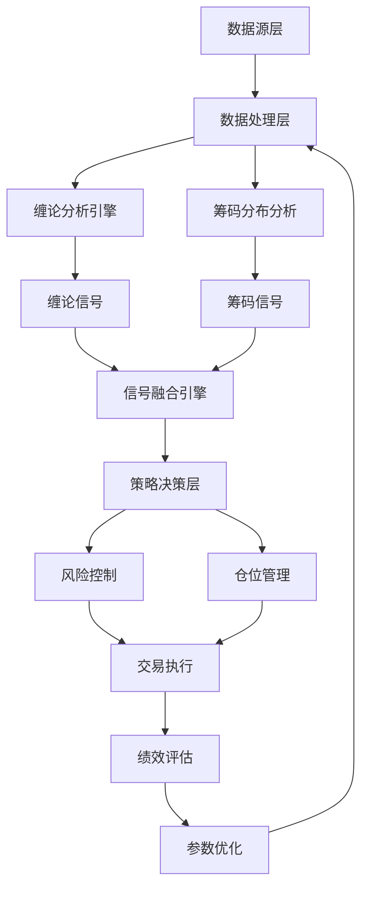
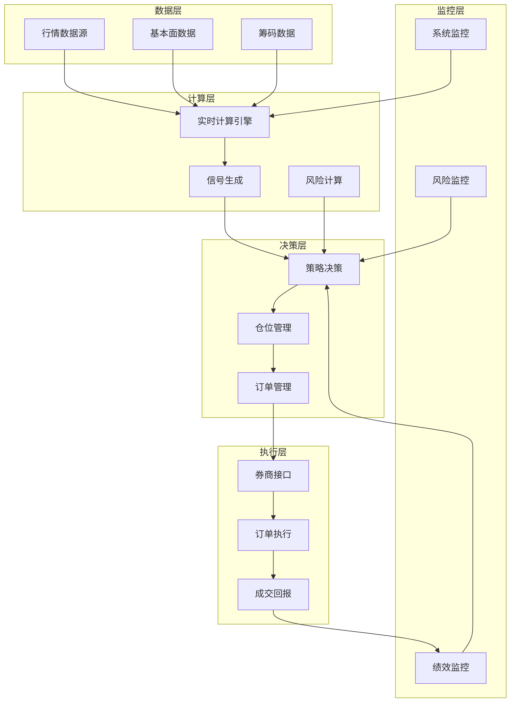

# 缠论量化策略借鉴与实施指南

## 一、现有缠论量化项目分析

### 1.1 GitHub主流缠论项目概览

| 项目名称 | GitHub仓库 | Star数量 | 最后更新时间 | 核心功能 | 技术特点 | 成熟度 | 适用场景 |
|---------|------------|----------|--------------|----------|----------|--------|----------|
| **CZSC** | `waditu/czsc` | 4.9k+ | 2025-09-27 | 完整量化研究框架，信号-因子-事件-交易体系 | Rust高性能库，多周期支持，可视化丰富 | 高 | 中高级量化研究，策略回测 |
| **chan.py** | 独立框架 | - | 持续更新 | 缠论核心实现，多级别联立，实时交易 | 高性能，支持多数据源，可对接实盘 | 中高 | 实时交易，多级别分析 |
| **chanlun.py** | `pypi/chanlun.py` | - | 持续更新 | 轻量级缠论实现，Backtrader回测接口 | 专注核心结构识别，轻量易用 | 中 | 快速原型，回测验证 |
| **chanlun_1-1** | 综合Web应用 | - | 持续更新 | Web应用，数据下载，图表展示，回测实盘 | 集成MySQL，Redis，Docker部署 | 中 | 全功能Web应用，团队协作 |
| **chan_framework** | 个人开发 | - | 持续更新 | 缠论框架雏形，形态学+动力学分析 | 适合二次开发，模块化设计 | 低 | 学习研究，定制开发 |

### 1.2 项目详细分析

#### 1.2.1 CZSC项目（推荐）

**项目地址**: https://github.com/waditu/czsc

**核心功能**:
- 自动识别K线合并、分型、笔、线段、中枢
- 多周期K线合成与联立分析
- 信号-事件-交易完整框架
- 内置丰富信号库（K线形态、技术指标、成交量等）
- 多源数据接入（A股、期货、数字货币）
- 回测引擎（wbt权重回测）
- 可视化（plotly静态图，lightweight-charts交互图）
- Streamlit Web应用

**技术特点**:
- 使用Rust高性能库`rs-czsc`替代Python实现
- 要求Python ≥ 3.10
- 模块化设计，易于扩展
- 支持权重序列回测，组合绩效归因

**成熟度评估**: **高**
- 活跃维护（最新版本1.0+）
- 完整文档和示例
- 社区活跃，问题响应及时
- 已在生产环境验证

**适用场景**:
- 中高级量化策略研究
- 多策略组合管理
- 机构级回测分析
- 需要高性能计算的场景

**限制条件**:
- 学习曲线较陡
- 对Python版本要求高
- 部分高级功能需要付费数据源

#### 1.2.2 chan.py项目

**项目特点**:
- 独立缠论量化交易框架
- 强调高性能和多级别联立
- 支持区间套策略
- 可对接实盘交易

**核心功能**:
- 自动识别分型、笔、线段、中枢
- 买卖点识别（形态学+动力学）
- 多数据源支持（akshare、baostock、富途等）
- 可视化与行情回放
- 交易策略构建模块

**技术架构**:
```python
# 核心模块结构
DataAPI/           # 数据接口层
├── AkshareAPI.py  # akshare数据源
├── BaostockAPI.py # baostock数据源
└── FutuAPI.py     # 富途数据源

Chan/              # 缠论核心引擎
├── CChan.py       # 主分析类
├── CChanConfig.py # 配置类
└── CChanTrader.py # 交易执行类

Plot/              # 可视化模块
└── CPlot.py       # 图表绘制

Strategy/          # 策略模块
├── BuySellPoint.py # 买卖点识别
└── Combiner.py    # 信号组合
```

**成熟度评估**: **中高**
- 设计思想成熟
- 功能完整
- 但文档相对较少
- 社区支持有限

**适用场景**:
- 实时交易系统
- 多级别联立分析
- 需要自定义策略的场景

#### 1.2.3 chanlun.py项目

**项目特点**:
- 轻量级缠论实现
- 专注核心结构识别
- 提供Backtrader回测接口

**核心功能**:
- 分型、笔、线段、中枢识别
- 背驰判断（简化版）
- Backtrader集成
- 基础可视化

**成熟度评估**: **中**
- 代码简洁易读
- 适合学习缠论原理
- 功能相对基础
- 维护活跃度一般

**适用场景**:
- 缠论学习入门
- 快速原型验证
- 简单回测需求

## 二、缠论+筹码分布复合策略架构

### 2.1 整体架构设计



### 2.2 多级别联立决策流程

```python
# 多级别决策流程示例
class MultiLevelDecision:
    def __init__(self, levels=['day', '30min', '5min']):
        self.levels = levels
        self.chan_engines = {}  # 各级别缠论引擎
        self.chip_analyzers = {}  # 各级别筹码分析器
        
    def analyze(self, symbol):
        signals = {}
        
        # 1. 大级别趋势判断（日线）
        day_signal = self._analyze_level('day', symbol)
        if day_signal.trend == 'up':
            signals['trend'] = 'bullish'
        elif day_signal.trend == 'down':
            signals['trend'] = 'bearish'
        else:
            signals['trend'] = 'consolidation'
            
        # 2. 中级别买卖点（30分钟）
        if signals['trend'] == 'bullish':
            mid_signal = self._analyze_level('30min', symbol)
            if mid_signal.buy_point == 'third_buy':
                signals['entry'] = 'confirmed'
                
        # 3. 小级别精确入场（5分钟）
        if signals.get('entry') == 'confirmed':
            min_signal = self._analyze_level('5min', symbol)
            if min_signal.confirmation:
                signals['exact_entry'] = True
                
        # 4. 筹码分布确认
        chip_signal = self.chip_analyzers['day'].analyze(symbol)
        if chip_signal.concentration_increasing:
            signals['chip_confirmed'] = True
            
        return signals
```

### 2.3 信号生成与过滤机制

#### 2.3.1 缠论信号生成

```python
class ChanSignalGenerator:
    def generate_signals(self, klines):
        signals = {
            'fractals': self._detect_fractals(klines),      # 分型
            'bi': self._detect_bi(klines),                  # 笔
            'segment': self._detect_segment(klines),        # 线段
            'zhongshu': self._detect_zhongshu(klines),      # 中枢
            'divergence': self._detect_divergence(klines),  # 背驰
            'buy_points': self._detect_buy_points(klines),  # 买点
            'sell_points': self._detect_sell_points(klines) # 卖点
        }
        return signals
        
    def _detect_buy_points(self, klines):
        """三类买点识别"""
        buy_points = []
        
        # 第一类买点：趋势背驰
        if self._is_first_buy(klines):
            buy_points.append({
                'type': 'first_buy',
                'confidence': 0.8,
                'conditions': ['trend_down', 'divergence', 'bi_complete']
            })
            
        # 第二类买点：第一类买点后回调不创新低
        if self._is_second_buy(klines):
            buy_points.append({
                'type': 'second_buy',
                'confidence': 0.7,
                'conditions': ['first_buy_confirmed', 'pullback_no_new_low']
            })
            
        # 第三类买点：上涨趋势中回调不进入中枢
        if self._is_third_buy(klines):
            buy_points.append({
                'type': 'third_buy',
                'confidence': 0.6,
                'conditions': ['uptrend', 'zhongshu_breakout', 'pullback_above_zhongshu']
            })
            
        return buy_points
```

#### 2.3.2 筹码分布信号

```python
class ChipDistributionAnalyzer:
    def analyze(self, symbol, date):
        """分析筹码分布"""
        analysis = {}
        
        # 获取筹码数据
        chip_data = self._get_chip_data(symbol, date)
        
        # 计算关键指标
        analysis['concentration'] = self._calc_concentration(chip_data)
        analysis['cost_distribution'] = self._calc_cost_distribution(chip_data)
        analysis['profit_ratio'] = self._calc_profit_ratio(chip_data)
        analysis['pressure_support'] = self._calc_pressure_support(chip_data)
        
        # 生成信号
        signals = []
        if analysis['concentration']['trend'] == 'increasing':
            signals.append('chip_concentrating')
        if analysis['profit_ratio'] > 0.7:
            signals.append('high_profit_pressure')
        if analysis['pressure_support']['resistance_distance'] < 0.05:
            signals.append('near_resistance')
            
        return {
            'analysis': analysis,
            'signals': signals
        }
```

#### 2.3.3 信号融合与过滤

```python
class SignalFusionEngine:
    def fuse_signals(self, chan_signals, chip_signals):
        """融合缠论和筹码信号"""
        fused_signals = {}
        
        # 买入信号融合
        buy_signals = []
        for buy in chan_signals.get('buy_points', []):
            # 基础过滤
            if buy['confidence'] < 0.6:
                continue
                
            # 筹码确认
            if 'chip_concentrating' in chip_signals:
                buy['chip_confirmed'] = True
                buy['confidence'] *= 1.2  # 提高置信度
                
            # 压力位过滤
            if 'near_resistance' in chip_signals:
                buy['confidence'] *= 0.8  # 降低置信度
                
            if buy['confidence'] > 0.65:
                buy_signals.append(buy)
                
        fused_signals['buy'] = buy_signals
        
        # 卖出信号融合
        sell_signals = []
        for sell in chan_signals.get('sell_points', []):
            # 筹码压力确认
            if 'high_profit_pressure' in chip_signals:
                sell['chip_confirmed'] = True
                sell['confidence'] *= 1.3
                
            if sell['confidence'] > 0.7:
                sell_signals.append(sell)
                
        fused_signals['sell'] = sell_signals
        
        return fused_signals
```

### 2.4 风险控制与仓位管理

#### 2.4.1 多层次风险控制

```python
class RiskManagementSystem:
    def __init__(self):
        self.max_drawdown_limit = 0.15  # 最大回撤15%
        self.position_limits = {
            'single_stock': 0.2,    # 单只股票20%
            'sector': 0.4,          # 单行业40%
            'total': 1.0            # 总仓位100%
        }
        
    def calculate_position_size(self, signal_confidence, volatility, account_value):
        """计算仓位大小"""
        # 基础仓位（根据置信度）
        base_position = signal_confidence * 0.1  # 10%基础
        
        # 波动率调整
        if volatility > 0.3:
            base_position *= 0.5
        elif volatility < 0.1:
            base_position *= 1.2
            
        # 账户规模调整
        if account_value > 1000000:
            base_position *= 0.8  # 大账户降低仓位
            
        # 确保不超过限制
        position = min(base_position, self.position_limits['single_stock'])
        
        return position * account_value
        
    def calculate_stop_loss(self, entry_price, signal_type, volatility):
        """计算止损位"""
        if signal_type == 'first_buy':
            # 第一类买点：前低下方
            stop_loss = entry_price * 0.95
        elif signal_type == 'third_buy':
            # 第三类买点：中枢上沿下方
            stop_loss = entry_price * 0.98
        else:
            # 默认：ATR止损
            atr_stop = volatility * 2
            stop_loss = entry_price * (1 - atr_stop)
            
        return stop_loss
```

#### 2.4.2 动态仓位管理

```python
class DynamicPositionManager:
    def manage_positions(self, current_positions, new_signals, market_condition):
        """动态仓位管理"""
        actions = []
        
        # 1. 检查现有持仓
        for position in current_positions:
            # 止盈止损检查
            if self._check_stop_loss(position):
                actions.append(('sell', position.symbol, 'stop_loss'))
            elif self._check_take_profit(position):
                actions.append(('sell', position.symbol, 'take_profit'))
                
        # 2. 处理新信号
        for signal in new_signals:
            if signal['type'] == 'buy':
                # 检查是否已有持仓
                if not self._has_position(signal.symbol):
                    # 计算可买入仓位
                    available_cash = self._calculate_available_cash()
                    position_size = self._calculate_position_size(
                        signal, available_cash, market_condition
                    )
                    
                    if position_size > 0:
                        actions.append(('buy', signal.symbol, position_size))
                        
        return actions
```

## 三、实施细节

### 3.1 技术栈选择建议

#### 3.1.1 Python版本与依赖库

```yaml
# requirements.yaml
python: ">=3.10"

core_dependencies:
  - numpy>=1.24.0
  - pandas>=2.0.0
  - scipy>=1.10.0
  
quant_frameworks:
  - czsc>=1.0.0          # 缠论核心框架
  - backtrader>=1.9.76.123  # 回测框架
  - empyrical>=0.5.5     # 绩效分析
  
data_sources:
  - akshare>=1.10.0      # 免费数据源
  - baostock>=0.8.0      # A股历史数据
  - tushare>=1.2.89      # 专业数据源（付费）
  
visualization:
  - plotly>=5.15.0
  - matplotlib>=3.7.0
  - seaborn>=0.12.0
  
machine_learning:
  - scikit-learn>=1.3.0
  - xgboost>=1.7.0
  - lightgbm>=4.0.0
  
development_tools:
  - jupyter>=1.0.0
  - black>=23.0.0
  - pytest>=7.3.0
```

#### 3.1.2 项目结构建议

```
缠论量化策略/
├── config/                 # 配置文件
│   ├── data_sources.yaml
│   ├── strategy_params.yaml
│   └── risk_rules.yaml
├── data/                   # 数据存储
│   ├── raw/               # 原始数据
│   ├── processed/         # 处理后数据
│   └── cache/             # 缓存数据
├── src/                    # 源代码
│   ├── data/              # 数据模块
│   │   ├── fetcher.py     # 数据获取
│   │   ├── processor.py   # 数据处理
│   │   └── storage.py     # 数据存储
│   ├── analysis/          # 分析模块
│   │   ├── chan_engine.py # 缠论引擎
│   │   ├── chip_analyzer.py # 筹码分析
│   │   └── signal_fusion.py # 信号融合
│   ├── strategy/          # 策略模块
│   │   ├── core.py        # 策略核心
│   │   ├── risk.py        # 风险控制
│   │   └── position.py    # 仓位管理
│   ├── backtest/          # 回测模块
│   │   ├── engine.py      # 回测引擎
│   │   ├── metrics.py     # 绩效指标
│   │   └── optimizer.py   # 参数优化
│   └── trade/             # 交易模块
│       ├── executor.py    # 交易执行
│       ├── broker.py      # 券商接口
│       └── monitor.py     # 交易监控
├── notebooks/             # Jupyter笔记本
│   ├── 01_data_exploration.ipynb
│   ├── 02_strategy_development.ipynb
│   └── 03_backtest_analysis.ipynb
├── tests/                 # 测试代码
├── docs/                  # 文档
└── scripts/               # 脚本文件
    ├── run_backtest.py
    ├── run_optimization.py
    └── deploy_live.py
```

### 3.2 数据源对接方案

#### 3.2.1 多数据源配置

```python
# config/data_sources.yaml
data_sources:
  akshare:
    enabled: true
    priority: 1
    config:
      timeout: 30
      retry_times: 3
      
  baostock:
    enabled: true
    priority: 2
    config:
      login_required: true
      user_id: "anonymous"
      password: "123456"
      
  tushare:
    enabled: false  # 需要付费
    priority: 3
    config:
      token: "${TUSHARE_TOKEN}"
      timeout: 60
      
  local:
    enabled: true
    priority: 0  # 最高优先级
    config:
      data_dir: "./data/processed"
      cache_ttl: 86400  # 24小时
```

#### 3.2.2 统一数据接口

```python
class UnifiedDataFetcher:
    def __init__(self, config):
        self.sources = self._init_sources(config)
        self.cache = DataCache()
        
    def fetch_klines(self, symbol, start_date, end_date, freq='day'):
        """获取K线数据"""
        # 1. 检查缓存
        cache_key = f"{symbol}_{start_date}_{end_date}_{freq}"
        cached = self.cache.get(cache_key)
        if cached:
            return cached
            
        # 2. 按优先级尝试数据源
        for source in self.sources:
            try:
                data = source.fetch_klines(symbol, start_date, end_date, freq)
                if data is not None and len(data) > 0:
                    # 缓存数据
                    self.cache.set(cache_key, data)
                    return data
            except Exception as e:
                logging.warning(f"数据源 {source.name} 失败: {e}")
                continue
                
        raise DataFetchError("所有数据源均失败")
        
    def fetch_chip_data(self, symbol, date):
        """获取筹码分布数据"""
        # 筹码数据需要特殊处理
        chip_data = {}
        
        # 尝试从专业数据源获取
        for source in ['tushare', 'akshare']:
            if source in self.sources:
                try:
                    chip_data = self.sources[source].fetch_chip_data(symbol, date)
                    if chip_data:
                        break
                except:
                    continue
                    
        # 如果没有专业数据，尝试计算近似值
        if not chip_data:
            chip_data = self._estimate_chip_data(symbol, date)
            
        return chip_data
```

### 3.3 回测框架配置

#### 3.3.1 Backtrader配置

```python
# backtest/config.py
BACKTEST_CONFIG = {
    'initial_cash': 1000000,      # 初始资金100万
    'commission': 0.0003,         # 佣金万分之三
    'slippage': 0.001,            # 滑点千分之一
    'trade_size': 100,            # 每手100股
    'start_date': '2020-01-01',
    'end_date': '2024-12-31',
    'benchmark': '000300.SH',     # 沪深300基准
    'universe': ['000001.SZ', '600519.SH', '000858.SZ'],  # 股票池
    'rebalance_freq': 'monthly',  # 月度调仓
    'data_freq': 'daily',         # 日线数据
    'warmup_period': 20,          # 20天预热期
}

# 策略参数
STRATEGY_PARAMS = {
    'chan': {
        'bi_strict': True,
        'seg_algo': 'chan',
        'divergence_threshold': 0.9,
        'min_bi_length': 5,
    },
    'chip': {
        'concentration_threshold': 0.6,
        'profit_ratio_threshold': 0.7,
        'lookback_period': 60,
    },
    'fusion': {
        'chan_weight': 0.6,
        'chip_weight': 0.4,
        'min_confidence': 0.65,
    },
    'risk': {
        'stop_loss_pct': 0.08,
        'take_profit_pct': 0.2,
        'max_position_pct': 0.2,
        'max_drawdown_limit': 0.15,
    }
}
```

#### 3.3.2 回测引擎实现

```python
class ChanChipBacktestEngine:
    def __init__(self, config):
        self.config = config
        self.cerebro = bt.Cerebro()
        
    def setup(self):
        """设置回测环境"""
        # 1. 设置初始资金
        self.cerebro.broker.setcash(self.config['initial_cash'])
        
        # 2. 设置交易费用
        self.cerebro.broker.setcommission(
            commission=self.config['commission'],
            margin=None,
            mult=1.0,
            name=None
        )
        
        # 3. 添加数据
        for symbol in self.config['universe']:
            data = self._load_data(symbol)
            self.cerebro.adddata(data, name=symbol)
            
        # 4. 添加策略
        self.cerebro.addstrategy(
            ChanChipStrategy,
            config=self.config
        )
        
        # 5. 添加分析器
        self.cerebro.addanalyzer(bt.analyzers.SharpeRatio, _name='sharpe')
        self.cerebro.addanalyzer(bt.analyzers.DrawDown, _name='drawdown')
        self.cerebro.addanalyzer(bt.analyzers.Returns, _name='returns')
        
    def run(self):
        """运行回测"""
        results = self.cerebro.run()
        
        # 提取结果
        strat = results[0]
        analysis = {
            'sharpe': strat.analyzers.sharpe.get_analysis(),
            'drawdown': strat.analyzers.drawdown.get_analysis(),
            'returns': strat.analyzers.returns.get_analysis(),
            'trades': self._analyze_trades(strat),
            'positions': self._analyze_positions(strat)
        }
        
        return analysis
        
    def plot_results(self):
        """绘制回测结果"""
        self.cerebro.plot(style='candlestick', volume=False)
```

### 3.4 参数优化方法

#### 3.4.1 网格搜索优化

```python
class ParameterOptimizer:
    def __init__(self, strategy_class, param_grid):
        self.strategy_class = strategy_class
        self.param_grid = param_grid
        self.results = []
        
    def grid_search(self, data, n_jobs=-1):
        """网格搜索参数优化"""
        from sklearn.model_selection import ParameterGrid
        
        param_combinations = list(ParameterGrid(self.param_grid))
        
        # 并行回测
        with ProcessPoolExecutor(max_workers=n_jobs) as executor:
            futures = []
            for params in param_combinations:
                future = executor.submit(
                    self._run_backtest, data, params
                )
                futures.append((params, future))
                
            # 收集结果
            for params, future in tqdm(futures):
                try:
                    result = future.result()
                    result['params'] = params
                    self.results.append(result)
                except Exception as e:
                    logging.error(f"参数 {params} 回测失败: {e}")
                    
        return self._analyze_results()
        
    def _run_backtest(self, data, params):
        """运行单次回测"""
        cerebro = bt.Cerebro()
        cerebro.adddata(data)
        cerebro.addstrategy(self.strategy_class, **params)
        cerebro.broker.setcash(1000000)
        
        results = cerebro.run()
        strat = results[0]
        
        # 计算绩效指标
        metrics = self._calculate_metrics(strat)
        return metrics
```

#### 3.4.2 贝叶斯优化

```python
class BayesianOptimizer:
    def __init__(self, strategy_class, param_bounds):
        self.strategy_class = strategy_class
        self.param_bounds = param_bounds
        self.optimizer = BayesianOptimization(
            f=self._objective_function,
            pbounds=param_bounds,
            random_state=42
        )
        
    def optimize(self, data, n_iter=50, init_points=10):
        """贝叶斯优化"""
        self.data = data
        
        self.optimizer.maximize(
            init_points=init_points,
            n_iter=n_iter
        )
        
        return self.optimizer.max
        
    def _objective_function(self, **params):
        """目标函数（最大化夏普比率）"""
        # 运行回测
        metrics = self._run_backtest_with_params(params)
        
        # 目标：夏普比率（可加入其他约束）
        sharpe = metrics.get('sharpe_ratio', 0)
        
        # 惩罚回撤过大
        max_dd = metrics.get('max_drawdown', 0)
        if max_dd > 0.2:
            sharpe *= 0.5
            
        # 惩罚交易次数过少
        trade_count = metrics.get('trade_count', 0)
        if trade_count < 10:
            sharpe *= 0.7
            
        return sharpe
```

### 3.5 实盘部署注意事项

#### 3.5.1 部署架构



#### 3.5.2 关键注意事项

1. **数据延迟处理**
   ```python
   class RealTimeDataProcessor:
       def handle_delayed_data(self, data, expected_time):
           """处理延迟数据"""
           current_time = datetime.now()
           delay = (current_time - expected_time).total_seconds()
           
           if delay > 60:  # 延迟超过60秒
               logging.warning(f"数据延迟 {delay}秒: {data.symbol}")
               # 触发异常处理流程
               self._handle_data_delay(data, delay)
           elif delay > 10:  # 延迟10-60秒
               # 使用插值或预测
               data = self._interpolate_data(data, delay)
               
           return data
   ```

2. **容错机制**
   ```python
   class FaultTolerantSystem:
       def __init__(self):
           self.failover_strategies = {
               'data_source': self._failover_data_source,
               'calculation': self._failover_calculation,
               'trade': self._failover_trade
           }
           
       def handle_failure(self, component, error):
           """处理组件失败"""
           logging.error(f"组件 {component} 失败: {error}")
           
           # 执行故障转移
           if component in self.failover_strategies:
               self.failover_strategies[component](error)
               
           # 发送警报
           self._send_alert(component, error)
           
           # 记录故障
           self._log_failure(component, error)
   ```

3. **监控与报警**
   ```python
   class MonitoringSystem:
       def __init__(self):
           self.metrics = {}
           self.alerts = []
           
       def monitor_system(self):
           """监控系统状态"""
           metrics = {
               'data_latency': self._check_data_latency(),
               'calculation_time': self._check_calculation_time(),
               'memory_usage': self._check_memory_usage(),
               'cpu_usage': self._check_cpu_usage(),
               'disk_space': self._check_disk_space(),
               'network_status': self._check_network(),
               'trade_status': self._check_trade_status()
           }
           
           # 检查阈值
           for metric, value in metrics.items():
               if self._exceeds_threshold(metric, value):
                   self._trigger_alert(metric, value)
                   
           return metrics
   ```

4. **日志与审计**
   ```python
   class AuditLogger:
       def __init__(self):
           self.loggers = {
               'trade': logging.getLogger('trade'),
               'system': logging.getLogger('system'),
               'data': logging.getLogger('data'),
               'risk': logging.getLogger('risk')
           }
           
       def log_trade(self, action, symbol, price, quantity, reason):
           """记录交易"""
           log_entry = {
               'timestamp': datetime.now().isoformat(),
               'action': action,
               'symbol': symbol,
               'price': price,
               'quantity': quantity,
               'reason': reason,
               'account': self._get_account_info(),
               'position': self._get_position_info(symbol)
           }
           
           self.loggers['trade'].info(json.dumps(log_entry))
           
           # 同时写入数据库
           self._write_to_database('trade_log', log_entry)
   ```

## 四、实施路线图

### 4.1 第一阶段：基础搭建（1-2个月）

| 任务 | 内容 | 产出物 |
|------|------|--------|
| 环境搭建 | Python环境，依赖库安装 | 可运行的开发环境 |
| 数据接口 | 实现akshare、baostock数据获取 | 统一数据接口类 |
| 缠论基础 | 实现分型、笔、线段识别 | ChanEngine基础类 |
| 回测框架 | Backtrader基础配置 | 基础回测引擎 |

### 4.2 第二阶段：策略开发（2-3个月）

| 任务 | 内容 | 产出物 |
|------|------|--------|
| 缠论完整实现 | 中枢、背驰、买卖点识别 | 完整的ChanEngine |
| 筹码分析 | 筹码分布计算与分析 | ChipAnalyzer类 |
| 信号融合 | 缠论+筹码信号融合逻辑 | SignalFusionEngine |
| 风险控制 | 止损、仓位管理实现 | RiskManagementSystem |

### 4.3 第三阶段：回测优化（1-2个月）

| 任务 | 内容 | 产出物 |
|------|------|--------|
| 历史回测 | 2018-2023年历史回测 | 回测报告 |
| 参数优化 | 网格搜索+贝叶斯优化 | 最优参数集 |
| 绩效分析 | 夏普、回撤、胜率等分析 | 绩效分析报告 |
| 策略改进 | 基于回测结果优化策略 | 优化后的策略 |

### 4.4 第四阶段：实盘准备（1个月）

| 任务 | 内容 | 产出物 |
|------|------|--------|
| 模拟盘测试 | 实时模拟盘测试 | 模拟盘测试报告 |
| 系统监控 | 监控、报警系统实现 | 监控系统 |
| 容错机制 | 故障转移、数据恢复 | 容错系统 |
| 文档完善 | 使用文档、部署文档 | 完整文档 |

### 4.5 第五阶段：实盘运行（持续）

| 任务 | 内容 | 产出物 |
|------|------|--------|
| 小资金实盘 | 10-50万资金实盘 | 实盘运行报告 |
| 持续优化 | 基于实盘反馈优化 | 优化版本 |
| 规模扩大 | 逐步增加资金规模 | 规模扩大计划 |
| 系统维护 | 日常维护、问题修复 | 维护日志 |

## 五、风险与挑战

### 5.1 技术风险

1. **数据质量风险**
   - 免费数据源不稳定
   - 数据延迟或缺失
   - 复权数据准确性

2. **算法实现风险**
   - 缠论算法实现偏差
   - 多级别协调复杂性
   - 实时计算性能要求

3. **系统稳定性风险**
   - 网络中断
   - 服务器故障
   - 第三方接口变更

### 5.2 市场风险

1. **策略失效风险**
   - 市场结构变化
   - 同质化策略竞争
   - 监管政策变化

2. **流动性风险**
   - 小盘股流动性不足
   - 极端行情下的流动性枯竭
   - 大额交易的市场冲击

### 5.3 应对措施

1. **技术层面**
   - 多数据源备份
   - 算法多重验证
   - 系统冗余设计

2. **策略层面**
   - 多策略组合
   - 动态参数调整
   - 严格风险控制

3. **运营层面**
   - 7x24小时监控
   - 定期策略回顾
   - 持续学习改进

## 六、结论与建议

### 6.1 项目可行性评估

**优势**:
1. 缠论理论体系完整，逻辑严谨
2. 已有成熟开源项目可借鉴
3. 缠论+筹码分布互补性强
4. A股市场适合技术分析策略

**挑战**:
1. 缠论算法实现复杂度高
2. 实时多级别分析计算量大
3. 免费数据源质量有限
4. 需要持续优化和维护

### 6.2 实施建议

1. **技术选型建议**
   - 核心框架：CZSC（成熟度高）
   - 回测框架：Backtrader（功能完整）
   - 数据源：akshare（免费）+ tushare（付费补充）
   - 部署方式：Docker容器化

2. **开发模式建议**
   - 采用敏捷开发，小步快跑
   - 先实现核心功能，再逐步完善
   - 重视测试和文档
   - 建立代码审查机制

3. **风险控制建议**
   - 从小资金开始实盘
   - 设置严格的止损规则
   - 建立完善的监控系统
   - 准备应急预案

4. **团队建设建议**
   - 需要量化研究员（策略）
   - 需要Python开发工程师（实现）
   - 需要运维工程师（部署）
   - 需要风险控制专员（监控）

### 6.3 预期成果

1. **短期（6个月）**
   - 完成策略开发和回测验证
   - 实现基础实盘交易系统
   - 小资金实盘测试

2. **中期（1年）**
   - 优化策略参数和逻辑
   - 扩大实盘资金规模
   - 建立完整的监控体系

3. **长期（2年+）**
   - 形成稳定的盈利模式
   - 开发更多相关策略
   - 考虑产品化或商业化

### 6.4 资源需求

| 资源类型 | 具体要求 | 估算成本 |
|----------|----------|----------|
| 人力资源 | 量化研究员1名，开发工程师1名 | 40-60万/年 |
| 技术资源 | 服务器、数据库、网络 | 5-10万/年 |
| 数据资源 | 付费数据源（tushare等） | 1-5万/年 |
| 软件工具 | 开发工具、监控工具 | 2-5万/年 |
| 测试资金 | 实盘测试资金 | 10-50万 |

**总计**: 首年投入约60-130万元，后续每年约20-50万元。

---

*本指南基于现有开源项目和市场实践整理，仅供参考。实际实施中需根据具体情况进行调整。投资有风险，入市需谨慎。*