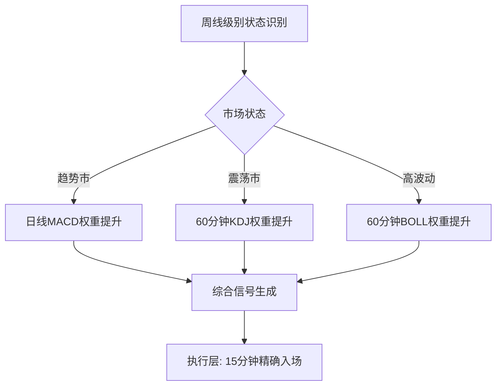

# 状态依赖的动态周期

状态依赖的动态周期是指根据当前市场状态（趋势/震荡/高波动）动态调整不同周期信号的权重，而非对所有周期一视同仁。

## 核心逻辑

并非所有周期在所有市场状态下都有用。通过[[市场状态识别（10种）]]和[[状态机市场识别模型]]，可以动态激活或关闭某些周期的信号：

- **趋势市**：大周期（日线/周线）信号权重占80%，小周期只用于微调
- **震荡市**：小周期（60分钟/30分钟）信号权重提升，大周期信号被压制
- **高波动市**：所有周期的信号都被降低权重，等待波动收缩

## 量化实现

在[[技术指标自适应权重融合策略]]中，状态机识别出市场状态后，动态调整各周期指标的权重：

## 关键原则

- **大周期负责"做什么"**：决定总体方向和仓位上限
- **小周期负责"何时做"**：在上下界内微调
- **状态决定权重**：不同市场状态下激活不同的周期组合